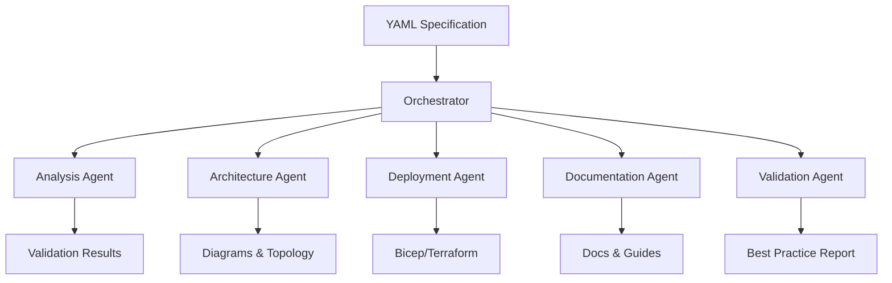

# AVD Accelerator - Spec-Driven Deployment

## 🚀 Overview

This spec-driven deployment system transforms Azure Virtual Desktop (AVD) deployments through **AI-powered agents** that automatically generate architecture diagrams, infrastructure code, documentation, and CI/CD pipelines from simple YAML specifications.

### Key Benefits

✅ **Declare, Don't Code** - Define your AVD requirements in YAML, not hundreds of lines of Bicep/Terraform  
✅ **AI-Powered Generation** - Agents automatically create IaC, diagrams, and docs  
✅ **Best Practices Built-In** - CAF naming, security baselines, monitoring included  
✅ **Multi-IaC Support** - Generate both Bicep and Terraform from same spec  
✅ **Comprehensive Documentation** - Auto-generated deployment guides and runbooks  

## 🎯 Quick Start

### 1. Create Your Specification

```yaml
apiVersion: avd.azure.com/v1
kind: AVDDeployment
metadata:
  name: my-avd-prod
  environment: production
  region: eastus2

spec:
  identity:
    provider: ADDS
    domainName: contoso.com
  
  hostPools:
    - name: hp-production
      type: Pooled
      sessionHosts:
        count: 10
        vmSize: Standard_D4s_v5
  
  networking:
    createNew: true
  
  security:
    privateLink:
      enabled: true
```

### 2. Generate Everything

```bash
python agents/core/orchestrator.py my-deployment.yaml
```

### 3. Deploy

```bash
cd generated/iac/bicep
./deploy.ps1 -SubscriptionId "<your-sub-id>"
```

## 📋 What You Get

When you run the orchestrator, AI agents generate:

### Architecture
- 📊 **Mermaid Diagrams** - Visual architecture representations
- 📝 **Topology Documentation** - Detailed resource layouts
- 🔗 **Dependency Graphs** - Resource relationships

### Infrastructure as Code
- 🏗️ **Bicep Templates** - Modular, deployable IaC
- 🌍 **Terraform Modules** - Multi-cloud ready
- ⚙️ **Parameter Files** - Environment-specific configs
- 🚀 **Deployment Scripts** - Ready-to-run automation

### Documentation
- 📖 **Deployment Guides** - Step-by-step instructions
- 📚 **Runbooks** - Operational procedures
- 🔧 **Troubleshooting** - Common issues and solutions
- 💰 **Cost Estimates** - Projected Azure costs

### CI/CD
- 🔄 **GitHub Actions** - Automated deployment workflows
- 📦 **Azure DevOps** - Enterprise pipeline templates

## 🏗️ Architecture



## 🤖 AI Agents

### Analysis Agent
Validates specifications, checks prerequisites, identifies requirements

### Architecture Agent
Generates visual diagrams, topology docs, dependency graphs

### Deployment Agent
Converts specs to Bicep/Terraform with CAF-compliant naming

### Documentation Agent
Creates deployment guides, runbooks, troubleshooting docs

### Validation Agent
Reviews artifacts against Azure best practices and security baselines

## 📚 Examples

### Basic Development Environment

```yaml
apiVersion: avd.azure.com/v1
kind: AVDDeployment
metadata:
  name: dev-avd
  environment: dev

spec:
  identity:
    provider: EntraID
  hostPools:
    - name: hp-dev
      type: Pooled
      sessionHosts:
        count: 2
        vmSize: Standard_D2s_v5
```

[View full example →](specs/examples/basic-deployment.yaml)

### Enterprise Production

```yaml
apiVersion: avd.azure.com/v1
kind: AVDDeployment
metadata:
  name: prod-avd
  environment: production

spec:
  identity:
    provider: ADDS
  hostPools:
    - name: hp-production
      sessionHosts:
        count: 20
        vmSize: Standard_D4s_v5
      scaling:
        enabled: true
  security:
    encryption:
      encryptionAtHost: true
    privateLink:
      enabled: true
```

[View full example →](specs/examples/enterprise-production.yaml)

## 📖 Documentation

- **[Getting Started](SPEC_DRIVEN_GETTING_STARTED.md)** - Complete walkthrough
- **[Architecture Overview](spec-driven-architecture.md)** - Design and implementation
- **[Specification Schema](specs/schema/avd-spec-v1.schema.json)** - Full spec reference
- **[Example Specifications](specs/examples/)** - Ready-to-use templates

## 🛠️ Advanced Features

### Multi-Region Deployments
Deploy to multiple Azure regions from a single spec:
```yaml
hostPools:
  - name: hp-primary
    location: eastus2
  - name: hp-dr
    location: westus2
```

### Custom Naming Conventions
Control resource naming:
```yaml
spec:
  deploymentPrefix: "ACME"
  # Generates: st-acme-*, kv-acme-*, etc.
```

### Brownfield Scenarios
Integrate with existing infrastructure:
```yaml
networking:
  createNew: false
  vnet:
    resourceId: "/subscriptions/.../vnet-existing"
```

### Autoscaling
Built-in scaling plans:
```yaml
scaling:
  enabled: true
  schedules:
    - name: weekday
      days: [Monday, Tuesday, Wednesday, Thursday, Friday]
      rampUpStartTime: "07:00"
      peakStartTime: "09:00"
```

## 🔧 Installation

### Prerequisites
- Python 3.9+
- Azure CLI or PowerShell
- (Optional) Node.js for diagram rendering

### Setup

```bash
# Clone repository
git clone https://github.com/Azure/avdaccelerator.git
cd avdaccelerator

# Install dependencies
pip install pyyaml jsonschema

# Validate installation
python agents/core/spec_parser.py specs/examples/basic-deployment.yaml
```

## 🎯 Use Cases

### Rapid Prototyping
Quickly spin up AVD environments for testing and demos

### Multi-Environment Deployments
Maintain consistent dev/test/prod environments from single source

### Enterprise Scale
Deploy standardized AVD across multiple business units

### Disaster Recovery
Generate DR configurations with different regions

### Compliance
Built-in security baselines and audit trails

## 📊 Comparison

| Traditional Approach | Spec-Driven Approach |
|---------------------|----------------------|
| Write 500+ lines of Bicep | Write 50 lines of YAML |
| Manual architecture diagrams | Auto-generated diagrams |
| Write deployment docs | Auto-generated documentation |
| Manual naming conventions | CAF-compliant auto-naming |
| Manual validation | AI-powered validation |
| One IaC language | Multiple IaC from one spec |

## 🤝 Contributing

Contributions are welcome! Areas for contribution:

- **New Agents** - Additional generation capabilities
- **IaC Targets** - Support for more platforms
- **Validation Rules** - Enhanced best practice checks
- **Documentation** - Examples and guides
- **Testing** - Expanded test coverage

See [CONTRIBUTING.md](CONTRIBUTING.md) for details.

## 🔍 How It Works

1. **Parse** - YAML spec validated against JSON schema
2. **Analyze** - Extract requirements and dependencies
3. **Generate** - AI agents create artifacts in parallel
4. **Validate** - Check against Azure best practices
5. **Output** - Organized directory structure with all artifacts

```
generated/
├── architecture/       # Diagrams and topology
├── iac/               # Bicep and Terraform
├── docs/              # Deployment guides
└── pipelines/         # CI/CD templates
```

## 📝 Specification Schema

The specification schema supports:

- ✅ Multiple identity providers (ADDS, Entra ID, Entra DS)
- ✅ Pooled and Personal host pools
- ✅ Autoscaling schedules
- ✅ FSLogix and App Attach storage
- ✅ Private Link and encryption
- ✅ Hub-spoke networking
- ✅ Monitoring and alerts
- ✅ Custom tags and naming

[View full schema →](specs/schema/avd-spec-v1.schema.json)

## 🚦 Roadmap

- [x] Core orchestration framework
- [x] Specification schema v1
- [x] Architecture agent (diagrams)
- [x] Deployment agent (Bicep)
- [ ] Documentation agent
- [ ] Validation agent
- [ ] Terraform generation
- [ ] CI/CD pipeline generation
- [ ] Cost estimation agent
- [ ] Migration from existing deployments
- [ ] Multi-region orchestration
- [ ] GUI specification builder

## 💡 Why Spec-Driven?

### Traditional IaC Challenges
- Complex, verbose code
- Hard to maintain across environments
- Manual documentation
- Inconsistent naming
- No visual representations

### Spec-Driven Benefits
- **Simplicity** - YAML over hundreds of lines of code
- **Consistency** - Same spec generates all artifacts
- **Automation** - AI agents do the heavy lifting
- **Standards** - Built-in best practices
- **Flexibility** - Multiple output formats

## 📞 Support

- **Issues** - [GitHub Issues](https://github.com/Azure/avdaccelerator/issues)
- **Discussions** - [GitHub Discussions](https://github.com/Azure/avdaccelerator/discussions)
- **Documentation** - [Microsoft Learn](https://learn.microsoft.com/azure/virtual-desktop/)

## 📄 License

This project is licensed under the MIT License - see [LICENSE](LICENSE) file for details.

## 🙏 Acknowledgments

Built on top of the excellent [Azure Virtual Desktop Landing Zone Accelerator](readme.md) by Microsoft and the Azure community.

---

**Ready to get started?** Check out the [Getting Started Guide](SPEC_DRIVEN_GETTING_STARTED.md) or try an [example specification](specs/examples/).
