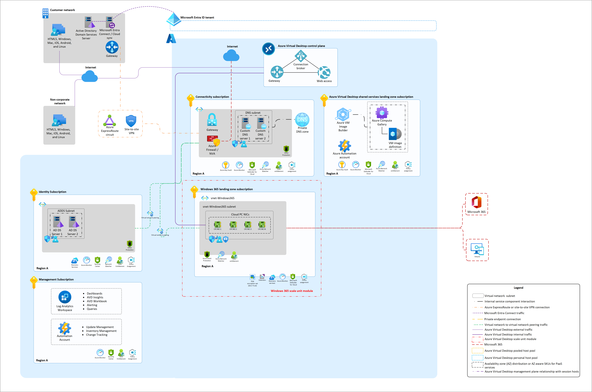

# Welcome to the Windows 365 Landing Zone Accelerator

 

[LZA Baseline](#azure-virtual-desktop---lza-baseline) | [Browfield Scenarios](#brownfield-scenarios) | [Custom Image Build](#custom-image-build) | [Architectural Diagram](#architectural-diagram)

## Overview

### Enterprise-scale for Windows 365

Enterprise-scale is an architectural approach and a reference implementation that enables effective construction and operation of landing zones on Azure, at scale. This approach aligns with the Azure roadmap and the Cloud Adoption Framework for Azure.

### Windows 365 Landing Zone Accelerator (LZA)

The Windows 365 Landing Zone Accelerator (LZA) represents the strategic design path and target technical state for Windows 365 deployment. This solution provides an architectural approach and reference implementation to prepare and expand landing zone subscriptions for a scalable Windows 365 deployment. For the architectural guidance in self hosted network environments, check out [Windows 365 Enterprise](https://learn.microsoft.com/en-us/windows-365/enterprise/deployment-options#azure-network-connection-option) Documentation.

### Scope and Assumptions

The Windows 365 Landing Zone Accelerator (LZA) only addresses what gets deployed in the specific Windows 365 landing zone subscriptions, highlighted by the red boxes in the architectural diagram below. It is assumed that an appropriate platform foundation is already set up, which may or may not be the official ALZ platform foundation. This means that policies and governance should already be in place or should be set up after this implementation and are not part of the scope of this program. The policies applied to management groups in the hierarchy above the subscription will trickle down to the Enterprise-scale for Windows 365 landing zone subscriptions.

## This Repository

This repository will contain various customer scenarios that can help accelerate the development and deployment of Windows 365 in a self-hosted network environment.
As of today, we have a first reference implementation scenario that is one of the most common ones used by Enterprise customers and partners and it can be used to deploy an Windows 365 workload. We will continue to add new scenarios in future updates.

## Getting Started

## Azure Virtual Desktop - LZA Baseline

[Getting Started](/workload/docs/getting-started-baseline.md) deploying Azure Virtual Desktop (AVD) resources and dependent services for establishing the baseline

- Azure Virtual Desktop resources: workspace, two (2) application groups, scaling plan and a host pool
- [Optional]: new virtual network (VNet) with NSGs, ASG and route tables
- Azure Files with Integration to the identity service
- Key vault
- Session Hosts

| Deployment Type | Link |
|:--|:--|
| Azure portal UI |  |
| Command line (Bicep/ARM) |  |

If you are having deployment challenges, refer to the [LZA baseline troubleshooting guide](/workload/docs/baseline-troubleshooting-guide.md) for guidance. For additional support please submit a GitHub issue.

## Architectural Diagram

_Download a [Visio file](./workload/docs/diagrams/w365-accelerator-baseline-architecture.vsdx) of this architecture._

## Contributing

This project welcomes contributions and suggestions.  Most contributions require you to agree to a
Contributor License Agreement (CLA) declaring that you have the right to, and actually do, grant us
the rights to use your contribution. For details, visit [https://cla.opensource.microsoft.com](https://cla.opensource.microsoft.com).

When you submit a pull request, a CLA bot will automatically determine whether you need to provide
a CLA and decorate the PR appropriately (e.g., status check, comment). Simply follow the instructions
provided by the bot. You will only need to do this once across all repos using our CLA.

This project has adopted the [Microsoft Open Source Code of Conduct](https://opensource.microsoft.com/codeofconduct/).
For more information see the [Code of Conduct FAQ](https://opensource.microsoft.com/codeofconduct/faq/) or
contact [opencode@microsoft.com](mailto:opencode@microsoft.com) with any additional questions or comments.

## Trademarks

This project may contain trademarks or logos for projects, products, or services. Authorized use of Microsoft
trademarks or logos is subject to and must follow
[Microsoft's Trademark & Brand Guidelines](https://www.microsoft.com/legal/intellectualproperty/trademarks).
Use of Microsoft trademarks or logos in modified versions of this project must not cause confusion or imply Microsoft sponsorship.
Any use of third-party trademarks or logos are subject to those third-party's policies.

## Reporting issues

Microsoft Support is not yet handling issues for any published tools in this repository. However, we would like to welcome you to open issues using GitHub [issues](https://github.com/Azure/avdaccelerator/issues) to collaborate and improve these tools.
