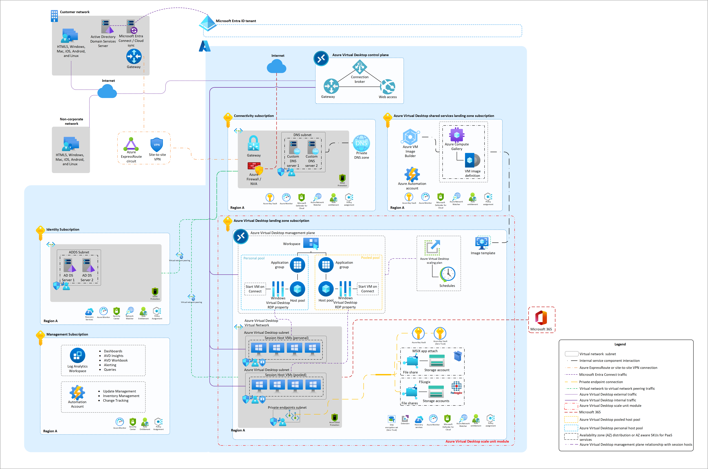

# Welcome to the Azure Virtual Desktop (AVD) Landing Zone Accelerator

## Overview

Enterprise-scale is an architectural approach and a reference implementation that enables effective construction and operation of landing zones on Azure, at scale. This approach aligns with the Azure roadmap and the Cloud Adoption Framework for Azure.

AVD Landing Zone Accelerator represents the strategic design path and target technical state for AVD deployment. This solution provides an architectural approach and reference implementation to prepare landing zone subscriptions for a scalable AVD deployment. For the architectural guidance, check out [Enterprise-scale for AVD in Microsoft Docs](https://docs.microsoft.com/azure/cloud-adoption-framework/scenarios/wvd/enterprise-scale-landing-zone).

The AVD Landing Zone Accelerator only addresses what gets deployed in the specific AVD landing zone subscriptions, highlighted by the red boxes in the picture above. It is assumed that an appropriate platform foundation is already setup which may or may not be the official [ALZ platform foundation](https://docs.microsoft.com/azure/cloud-adoption-framework/ready/enterprise-scale/implementation#reference-implementation). This means that policies and governance should already be in place or should be set up after this implementation and are not a part of the scope this program. The policies applied to management groups in the hierarchy above the subscription will trickle down to the Enterprise-scale for AVD landing zone subscriptions.

## This Repository

This repository will contain various customer scenarios that can help accelerate the development and deployment of AVD that conforms with [Enterprise-Scale for AVD best practices and guidelines](https://docs.microsoft.com/azure/cloud-adoption-framework/scenarios/wvd/ready). Each scenario aims to represent common customer experiences with the goal of accelerating the process of developing and deploying conforming AVD using IaaC. Each scenario will eventually have an ARM, Bicep, PowerShell and CLI version to choose from.
As of today, we have a first reference implementation scenario that is one of the most common ones used by Enterprise customers and partners and it can be used to deploy an AVD workload. We will continue to add new scenarios in future updates.

## Getting Started

Head over to [Getting Started](/workload/docs/getting-started.md) to review prerequisites and deployment options.

## AVD Accelerator Baseline

Deploy Azure Virtual Desktop (AVD) resources and dependent services for establishing the baseline
- AVD resources: workspace, two (2) application groups and host pool
- [Optional]: new virtual network (VNet) with baseline NSG and route table
- Azure Files share. Integration with Active Directory 
- Session Hosts 

| Deployment Type | Link |
|:--|:--|
| Azure portal UI |  |
| Command line (Bicep/ARM) |  |
| Terraform |  |

## Optional: Custom Image Build

Deploy a custom image based on the latest version of the Azure marketplace image to an Azure Compute Gallery. The following images are offered: 
 - Windows 10 21H2
 - Windows 11 21H2
 - Windows 10 21H2 with O365
 - Windows 11 21H2 with O365

Custom image is optimized using [Virtual Desktop Optimization Tool (VDOT)](https://github.com/The-Virtual-Desktop-Team/Virtual-Desktop-Optimization-Tool) and patched with the latest Windows updates. 

| Deployment Type | Link |
|:--|:--|
| Azure portal UI |  |
| Command line (Bicep/ARM) |  |
| Terraform |  |

## Architectural Diagram

_Download a [Visio file](./workload/docs/diagrams/avd-accelerator-baseline-architecture.vsdx) of this architecture._

## Contributing

This project welcomes contributions and suggestions.  Most contributions require you to agree to a
Contributor License Agreement (CLA) declaring that you have the right to, and actually do, grant us
the rights to use your contribution. For details, visit [https://cla.opensource.microsoft.com](https://cla.opensource.microsoft.com).

When you submit a pull request, a CLA bot will automatically determine whether you need to provide
a CLA and decorate the PR appropriately (e.g., status check, comment). Simply follow the instructions
provided by the bot. You will only need to do this once across all repos using our CLA.

This project has adopted the [Microsoft Open Source Code of Conduct](https://opensource.microsoft.com/codeofconduct/).
For more information see the [Code of Conduct FAQ](https://opensource.microsoft.com/codeofconduct/faq/) or
contact [opencode@microsoft.com](mailto:opencode@microsoft.com) with any additional questions or comments.

## Trademarks

This project may contain trademarks or logos for projects, products, or services. Authorized use of Microsoft
trademarks or logos is subject to and must follow
[Microsoft's Trademark & Brand Guidelines](https://www.microsoft.com/legal/intellectualproperty/trademarks).
Use of Microsoft trademarks or logos in modified versions of this project must not cause confusion or imply Microsoft sponsorship.
Any use of third-party trademarks or logos are subject to those third-party's policies.

## Reporting issues

Microsoft Support is not yet handling issues for any published tools in this repository. However, we would like to welcome you to open issues using GitHub [issues](https://github.com/Azure/avdaccelerator/issues) to collaborate and improve these tools.