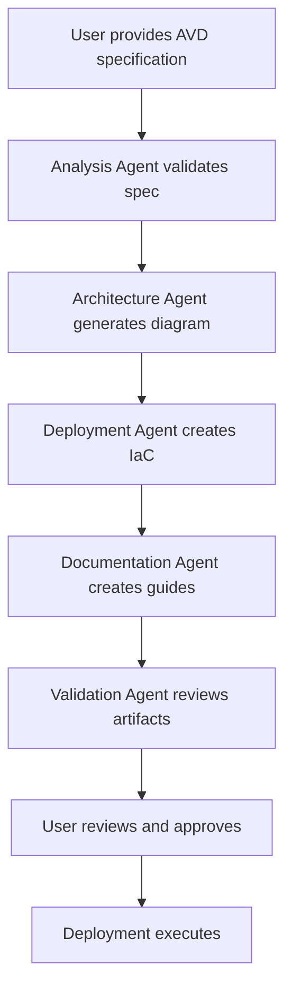

# AVD Accelerator - Spec-Driven Deployment Architecture

## Overview

This document outlines the spec-driven deployment architecture for the Azure Virtual Desktop (AVD) Accelerator, enabling AI agents to automatically generate architecture diagrams, documentation, and deployment artifacts from declarative specifications.

**Based on Analysis of:** `workload/bicep/deploy-baseline.bicep` (1659 lines)
- Complete AVD deployment with 150+ parameters
- 15+ modular components
- Full support for ADDS, Entra DS, Entra ID, and Entra ID Kerberos
- Zero Trust, monitoring, scaling, and private endpoint configurations

## Architecture Components

### 1. Specification Layer
- **Declarative YAML/JSON specifications** that define the desired AVD deployment
- **Schema validation** to ensure specifications are complete and valid
- **Version control** for specification files

### 2. Agent Orchestration Layer
- **Analysis Agent**: Analyzes specifications and existing infrastructure
- **Architecture Agent**: Generates architecture diagrams and topology
- **Documentation Agent**: Creates deployment guides and operational docs
- **Deployment Agent**: Generates IaC (Bicep/Terraform) and deployment scripts
- **Validation Agent**: Validates generated artifacts against best practices

### 3. Generation Layer
- **Architecture Diagram Generation**: Creates visual representations using Mermaid/Visio
- **IaC Generation**: Produces Bicep/Terraform templates
- **Documentation Generation**: Creates markdown docs, runbooks, troubleshooting guides
- **CI/CD Pipeline Generation**: Generates GitHub Actions/Azure DevOps pipelines

### 4. Deployment Layer
- **Pre-flight checks**: Validates prerequisites and permissions
- **Resource provisioning**: Deploys infrastructure using generated IaC
- **Configuration**: Applies settings and policies
- **Validation**: Verifies deployment success

## Specification Schema

The specification schema captures all aspects of an AVD deployment:

```yaml
apiVersion: avd.azure.com/v1
kind: AVDDeployment
metadata:
  name: example-avd-deployment
  environment: production
  region: eastus2

spec:
  # Identity configuration
  identity:
    provider: ADDS | EntraDS | EntraID | EntraIDKerberos
    domainName: contoso.com
    domainGuid: optional-guid
    ouPath: OU=AVD,DC=contoso,DC=com
    
  # Host pool configuration
  hostPools:
    - name: hp-pooled-prod
      type: Pooled | Personal
      location: eastus2
      preferredAppGroupType: Desktop | RemoteApp
      publicNetworkAccess: Disabled | Enabled | EnabledForClientsOnly
      maxSessionLimit: 10
      loadBalancerType: BreadthFirst | DepthFirst
      
      # Session hosts
      sessionHosts:
        count: 5
        vmSize: Standard_D4s_v5
        imageSource: marketplace | gallery | custom
        marketplace:
          publisher: MicrosoftWindowsDesktop
          offer: office-365
          sku: win11-23h2-avd-m365
        diskType: Premium_LRS
        acceleratedNetworking: true
        
      # Scaling
      scaling:
        enabled: true
        schedule:
          - name: business-hours
            days: [Monday, Tuesday, Wednesday, Thursday, Friday]
            rampUpStartTime: 08:00
            peakStartTime: 09:00
            rampDownStartTime: 18:00
            offPeakStartTime: 20:00
            
  # Networking
  networking:
    createNew: true | false
    vnet:
      name: vnet-avd-prod
      addressSpace: 10.100.0.0/16
      subnets:
        - name: snet-avd-sessionhosts
          addressPrefix: 10.100.1.0/24
        - name: snet-avd-privateendpoints
          addressPrefix: 10.100.2.0/24
    hubVnet:
      enabled: true
      vnetResourceId: /subscriptions/.../vnet-hub
      
  # Storage
  storage:
    fslogix:
      enabled: true
      storageType: AzureFiles | AzureNetAppFiles
      azureFiles:
        sku: Premium_LRS
        quota: 1024
        privateEndpoint: true
    appAttach:
      enabled: true
      storageType: AzureFiles
      
  # Security
  security:
    encryption:
      encryptionAtHost: true
      diskEncryptionKeyExpiration: 60
    privateLink:
      enabled: true
      dnsZones:
        - privatelink.file.core.windows.net
        - privatelink.vaultcore.azure.net
    confidentialVm: false
    trustedLaunch: true
    
  # Monitoring
  monitoring:
    logAnalytics:
      enabled: true
      retentionDays: 90
    insights:
      enabled: true
    alerts:
      enabled: true
      
  # Policies
  policies:
    gpu: false
    monitoring: true
    networking: true
    zeroTrust: true
    
  # Tags
  tags:
    CostCenter: IT-001
    Environment: Production
    Owner: AVD-Team
```

## Agent Workflows

### Workflow 1: Initial Deployment from Specification



### Workflow 2: Architecture Generation

The Architecture Agent will:
1. Parse the specification
2. Identify all Azure resources needed
3. Map dependencies between resources
4. Generate architecture diagrams (Mermaid, Visio, PNG)
5. Create topology documentation

### Workflow 3: IaC Generation

The Deployment Agent will:
1. Convert specification to Bicep/Terraform modules
2. Apply naming conventions (CAF compliant)
3. Configure resource dependencies
4. Add parameter files
5. Generate deployment scripts

### Workflow 4: Documentation Generation

The Documentation Agent will:
1. Create deployment guides with step-by-step instructions
2. Generate prerequisites checklists
3. Create operational runbooks
4. Build troubleshooting guides
5. Document cost estimates

## Implementation Plan

### Phase 1: Core Infrastructure (Weeks 1-2)
- Create specification schema and validation
- Build specification parser
- Develop core agent framework

### Phase 2: Agent Development (Weeks 3-6)
- Implement Architecture Agent
- Implement Deployment Agent (Bicep generation)
- Implement Documentation Agent
- Implement Validation Agent

### Phase 3: Advanced Features (Weeks 7-10)
- Add Terraform support
- Implement CI/CD pipeline generation
- Add brownfield scenario support
- Implement incremental updates

### Phase 4: Testing & Refinement (Weeks 11-12)
- End-to-end testing
- Documentation completion
- Example specifications
- Performance optimization

## Directory Structure

```
avd-spec-driven/
├── specs/                           # Specification files
│   ├── schema/
│   │   └── avd-spec-v1.schema.json
│   ├── examples/
│   │   ├── basic-deployment.yaml
│   │   ├── enterprise-deployment.yaml
│   │   └── multi-region.yaml
│   └── templates/
│       └── default-template.yaml
│
├── agents/                          # Agent implementations
│   ├── core/
│   │   ├── orchestrator.py
│   │   ├── spec_parser.py
│   │   └── validator.py
│   ├── analysis/
│   │   └── analysis_agent.py
│   ├── architecture/
│   │   ├── diagram_generator.py
│   │   └── topology_builder.py
│   ├── deployment/
│   │   ├── bicep_generator.py
│   │   ├── terraform_generator.py
│   │   └── naming_service.py
│   └── documentation/
│       ├── doc_generator.py
│       └── templates/
│
├── generated/                       # Agent-generated artifacts
│   ├── architecture/
│   │   ├── diagrams/
│   │   └── topology/
│   ├── iac/
│   │   ├── bicep/
│   │   └── terraform/
│   ├── docs/
│   │   ├── deployment-guides/
│   │   ├── runbooks/
│   │   └── troubleshooting/
│   └── pipelines/
│       ├── github-actions/
│       └── azure-devops/
│
├── tests/                           # Test suite
│   ├── unit/
│   ├── integration/
│   └── e2e/
│
└── docs/                            # Framework documentation
    ├── README.md
    ├── getting-started.md
    ├── agent-development.md
    └── specification-guide.md
```

## Benefits

1. **Consistency**: All deployments follow the same patterns and best practices
2. **Speed**: Rapid generation of deployment artifacts from specifications
3. **Documentation**: Automatic generation of comprehensive documentation
4. **Validation**: Built-in validation against Azure best practices
5. **Versioning**: Specifications are version-controlled and auditable
6. **Flexibility**: Support for both greenfield and brownfield scenarios
7. **Multi-IaC**: Generate both Bicep and Terraform from same spec

## Next Steps

1. Review and refine the specification schema
2. Implement the core agent framework
3. Develop the first agent (Architecture Agent)
4. Create example specifications
5. Build validation and testing framework
