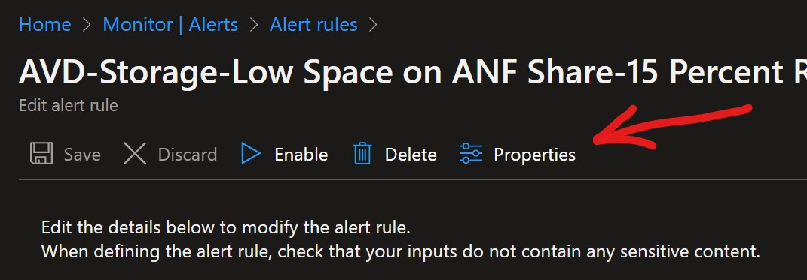
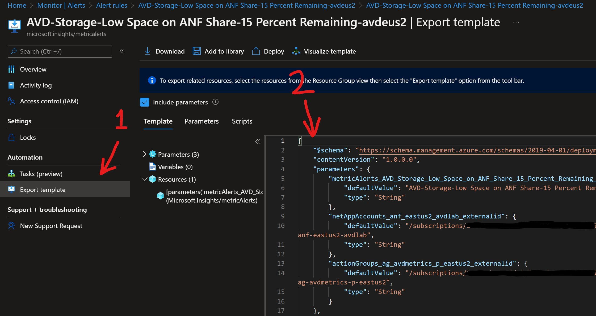
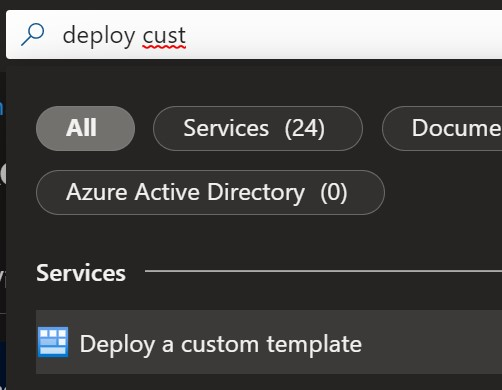
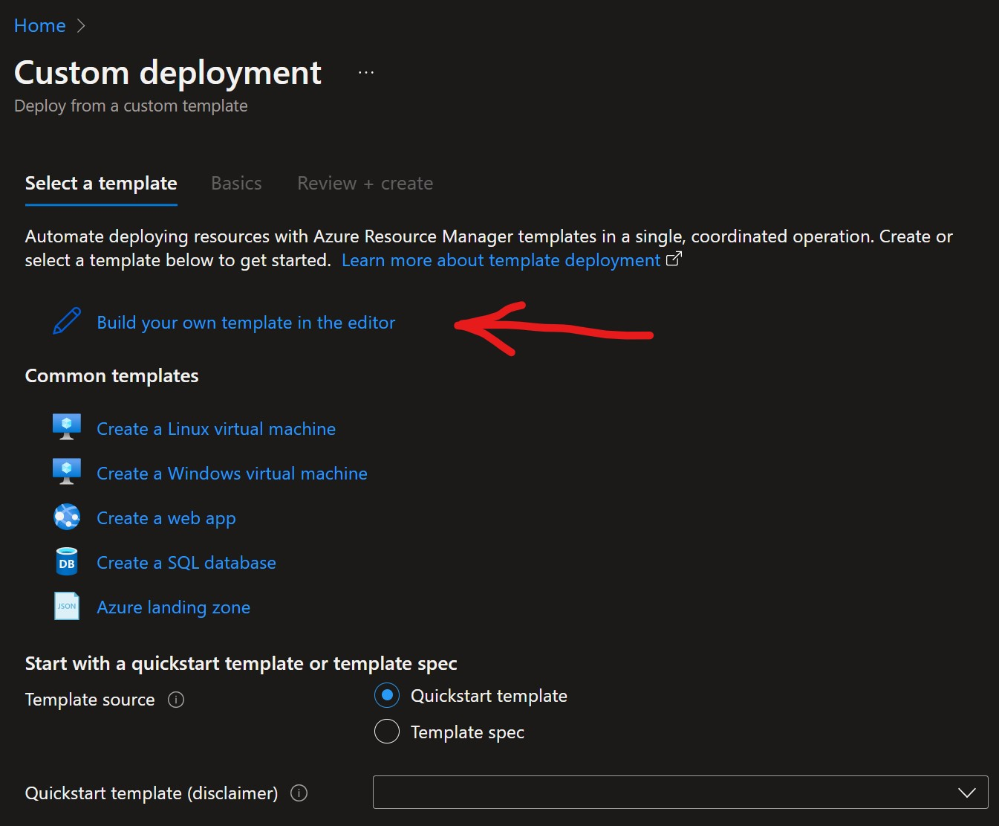
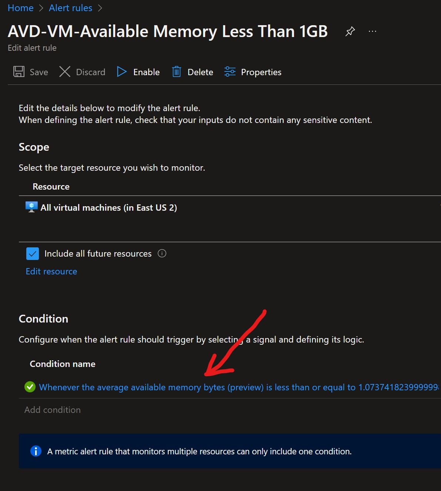
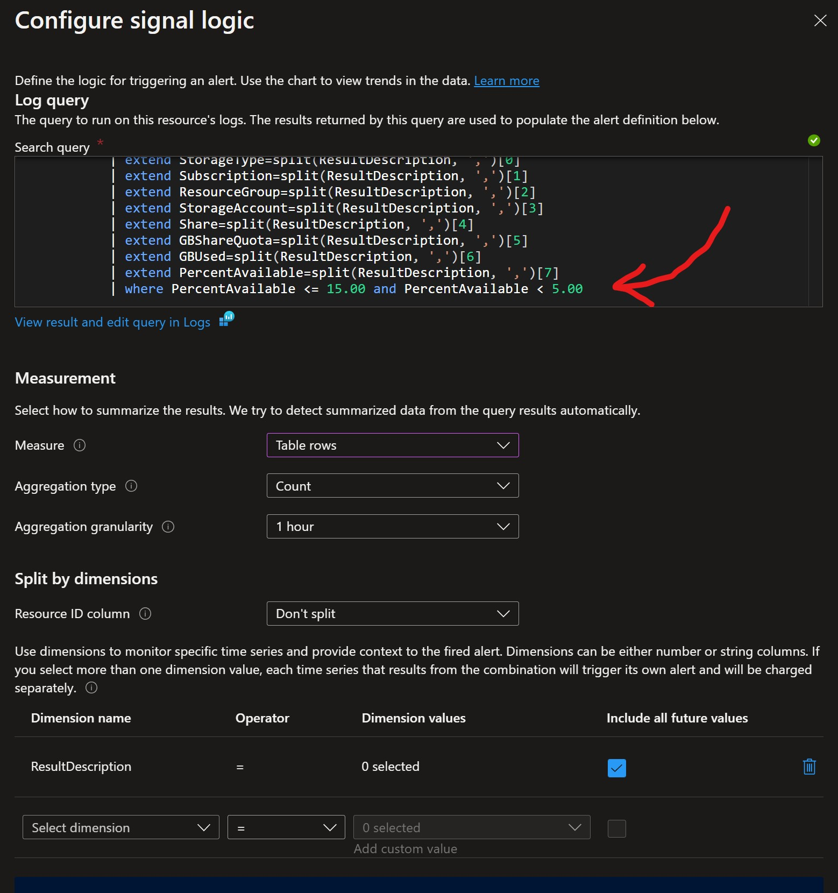
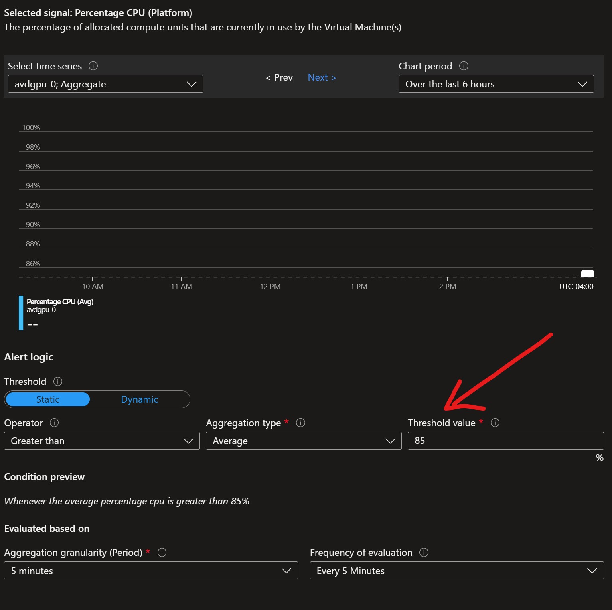

# Change Alert Rule Threshold

[Home](./readme.md) | [PostDeployment](./postDeploy.md) | [Alert Reference](./alertReference.md) | [Excel List of Alert Rules](./references/alerts.xlsx) | [Update History](./updateHistory.md)

The thresholds configured for the solution are not necessarily ideal for all organizations.  In the event you would like to edit or change any of the pre-configured thresholds you can easily do so.  It is recommended that any alert and it's associated threshold is meaningful and actionable. Thus you should have alerts that fire or trigger when you want them to.  Keep in mind the alert rules with percentages can be subjective as well when it comes to things like storage space available. Most of the provided Kusto queries that make up the Log Search may vary but should be easy enough to determine.  

__Note:__ Unfortunately the thresholds denoted in the Alert Rule Name cannot be changed. Thus you'll need to create another rule with a new name containing the desired value and then update the query syntax or metric.  

## Copy / Duplicate Alert Rule

[From the Alert Rules Portal Page](https://portal.azure.com/#blade/Microsoft_Azure_Monitoring/AzureMonitoringBrowseBlade/alertsV2)  
[(Ensure you clear the filter or change the view to see any disabled alerts!)](./postDeploy.md)

1. Click on an Alert Rule you would like to change or modify.  
2. Select Properties at the top of the page.  
  
3. Click Export Template and select all JSON text in the box to the right and copy it.

4. Now use the search box in the top of the Azure Portal and open the "Deploy a custom template" page

5. Select the option to "Build your own template in the editor"

6. In the editor box on the right, select all the text and replace it with what was copied in step 3.
7. Click Save.
8. Ensure you have the same Resource Group selected where all the current alert rules were deployed. (i.e. rg-avdmetrics-)
9. In some cases Validation may have a red banner with a note about accepting the terms of agreement, and it can be ignored.
10. Click Create and then review the alert and updated the query or metric as needed.  

## Adjust Threshold

1. From the Alert Rules list/page, click on an Alert Rule you would like to change or modify.  
2. Click on the "Condition name" usually in blue.  
  
3. Edit the information on the blade that pops out on the right side.  
    - For __Log Search type alerts__, adjust the Kusto Query in the top box with most thresholds being the last line.  
      
    - For __Metric type alerts__, there typically is a "Threshold value" field in the "Alert Logic" section.  
     
4. Be sure to save the changes on the right hand blade as well as the Alert Rule.  
