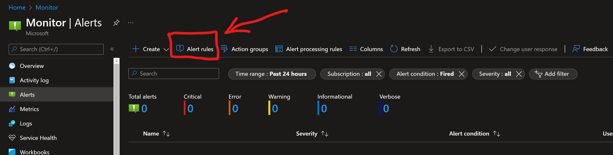
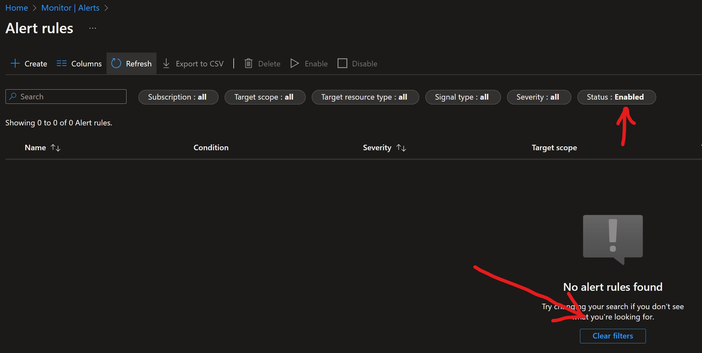
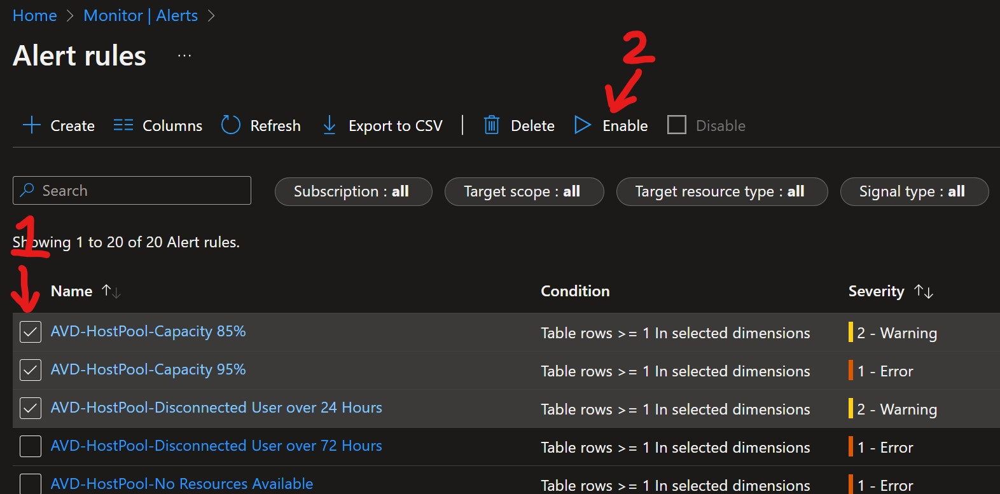

# Post Deployment Instructions

[Home](./readme.md) | [How to Change Thresholds](./changeAlertThreshold.md) | [Alert Reference](./alertReference.md) | [Excel List of Alert Rules](./references/alerts.xlsx) | [Update History](./updateHistory.md)

## View / Enable Alerts after deployment

By design the alerts solution is deployed with all alerts being disabled in order to provide administrators to view, adjust and enable them in phases or as needed. It is recommended to start with only a few to ensure the thresholds meet your needs and false alerts are not produced or an overwhelming number of alerts flood an email account. 

You can also review the Alert Action Group and adjust as needed with additional email addresses or other methods for recieving notifications.  

1. Open the [Alerts Azure Portal Page](https://portal.azure.com/#blade/Microsoft_Azure_Monitoring/AzureMonitoringBrowseBlade/alertsV2)  
2. Click on the "Alert rules" section at the top of the page.  
  
3. Initially the list of alert rules may be filtered out or appear missing.  Simply change the filter to include "disabled" or click the "Clear filters" option.  
  
4. Select the check box next to each you would like to enable and click "Enable" at the top of the page.  
