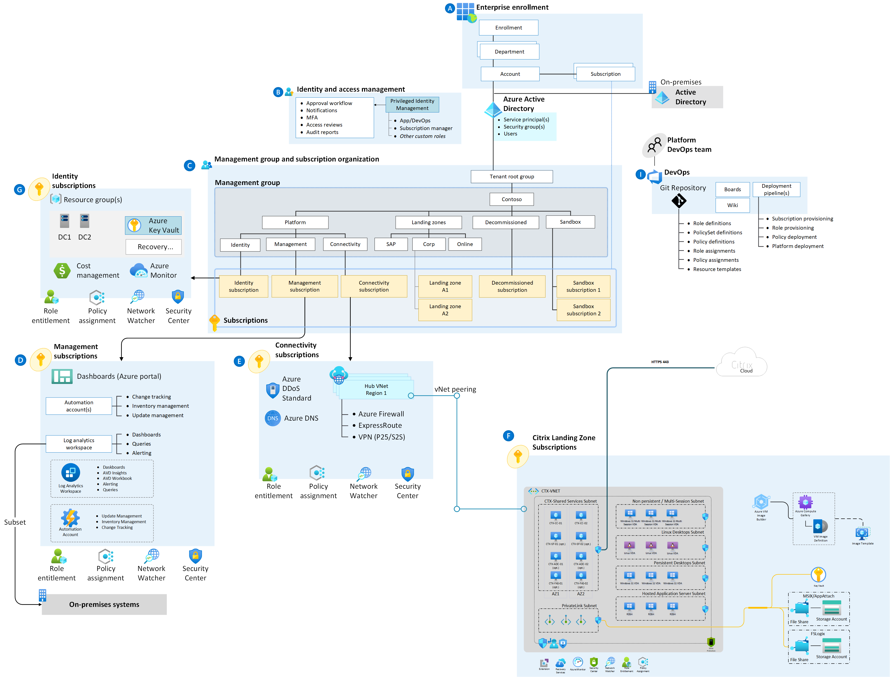
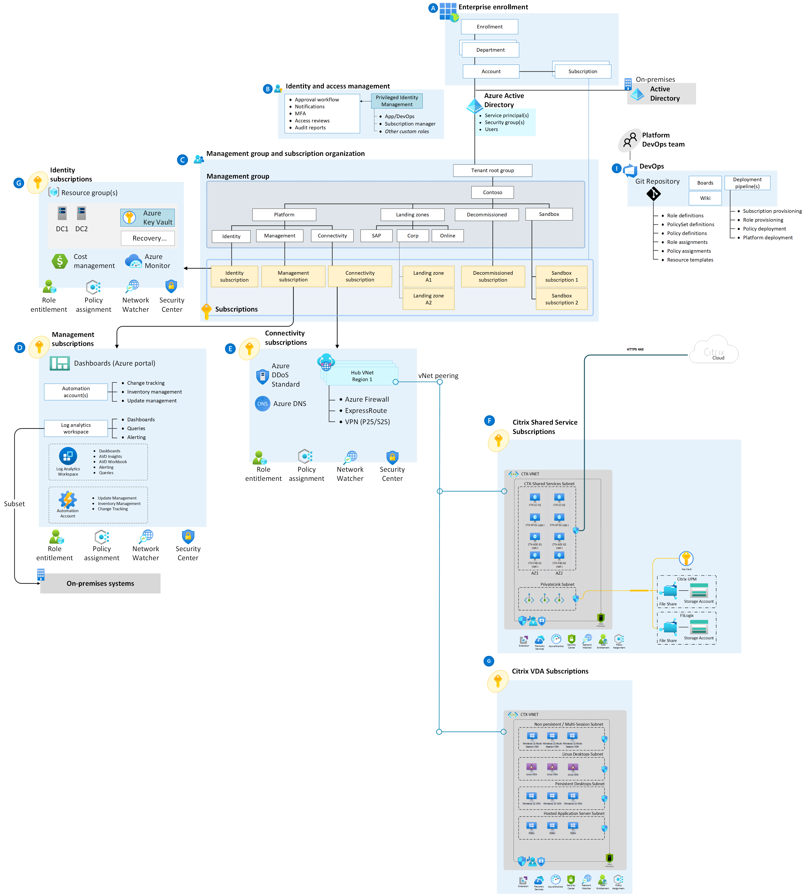

# Disclaimer
Please Note that Citrix Landing Zone Accelerator IS STILL A WORK IN PROGRESS!   Periodically, we will be tweaking things and making changes–so expect to be surprised periodically as we do our best to make the LZ content better for all of you. Thank you for your understanding and please feel free to open Git issues with feedback/suggestions.

# Adopt the Citrix Cloud and Azure Landing Zone Accelerator

Citrix and Microsoft partnered together to accelerate the future of work. Employees need a consistent experience and seamless access to the applications and insights vital to doing their best work wherever work needs to get done – in the office, on the road, or at home. The above list is not all inclusive of Citrix capabilities when deployed with Microsoft solutions for more information please refer to the following: [Citrix Tech Zone – Enhancing Azure Virtual Desktop](https://docs.citrix.com/en-us/tech-zone/learn/tech-briefs/windows-virtual-desktop-value-add.html).

This reference implementation adheres to the architecture and best practices of the Cloud Adoption Framework's Azure landing zones with a particular focus on the enterprise-scale design principles. Although this implementation can be deployed in any Azure environment that complies with the [prerequisites](https://github.com/Azure/avdaccelerator/blob/main/workload/docs/getting-started-baseline.md#prerequisites), It is recommended to use this solution after implementing an enterprise-scale landing zone, [enterprise-scale overview](../../ready/enterprise-scale/index.md) and [implementation guidance](../../ready/enterprise-scale/implementation.md) before deploying the enterprise-scale for Desktop Virtualization solution.

### Customer Profile 
This scenario is ideal if: 
- Critical applications or services are identified that will remain on-premises  
- Migration from on-premises to Azure will occur in multiple phases but requires seamless access by end users throughout the project 
- Granular peripheral controls (USB, clipboard, printing, etc.) to securely accommodate user workflows or maintain compliance are required 
- Use cases utilize 3D graphics or require connectivity over challenging networks (low bandwidth, high latency) 
- Support for Linux workloads is required 
- Support for non-persistent workloads is required 
- Non-Microsoft solutions for collaboration, authentication, or identity are required
- B2B or guest user access is required  

### Design guidelines

Design guidance for Citrix DaaS on Microsoft Azure is available on [Citrix TechZone](https://docs.citrix.com/en-us/tech-zone/toc/by-solution/daas-for-azure/design-guidance.html) and highlights the system, workload, user, and network considerations for Citrix technologies in alignment with Cloud Adoption Framework design principles.

Learn the guidelines that direct the design of the Cloud Adoption Framework for Azure enterprise-scale landing zone. The guidelines cover eight critical design areas:
- [Enterprise enrollment](./eslz-enterprise-enrollment.md)
- [Identity and access management](./eslz-identity-and-access-management.md)
- [Network topology and connectivity](./eslz-network-topology-and-connectivity.md)
- [Resource organization](./eslz-resource-organization.md)
- [Management and monitoring](./eslz-management-and-monitoring.md)
- [Business continuity and disaster recovery](./eslz-business-continuity-and-disaster-recovery.md)
- [Security, governance, and compliance](./eslz-security-governance-and-compliance.md)
- [Platform automation and DevOps](./eslz-platform-automation-and-devops.md)

### Architecture

The following two diagram shows a conceptual reference architecture that demonstrates major design areas and design best practices in an Citrix Cloud and Azure environment.

**Reference concept 1 - single subscription deployment**
[](./diagrams/citrix-cloud-azure-virtual-desktop-architecture-1.png#lightbox)

**Reference concept 2 - multi subscription deployment**
[](./diagrams/citrix-cloud-azure-virtual-desktop-architecture-2.png#lightbox)

Download the [Visio file](../diagrams/Citrix-accelerator-enterprise-scale-alz-architecture.vsdx) here.

# Design areas – Identity and access management
**Scenario Identity and access design considerations for Citrix on Azure**

** Design considatation **

-	Like an Azure subscription, a Citrix Cloud tenant only supports [a single Microsoft Entra tenant for user or admin authentication](https://docs.citrix.com/en-us/citrix-workspace/secure.html#azure-active-directory). If development and production Microsoft Entra tenant isolation is required for your operational processes, similar isolation should be established for your Citrix Cloud tenants.
-	Citrix supports Azure B2B or guest accounts using SAML authentication in Workspace or Citrix Gateway and Citrix Federated Authentication Service. For more information, see [How to configure Microsoft Entra ID and SAML for Guest Accounts](https://support.citrix.com/article/CTX312151/how-to-configure-azure-ad-and-saml-tech-preview-for-guest-accounts).
-	Citrix includes built-in RBAC capabilities for core administration and monitoring of the associated Citrix virtual apps and desktops. For more information, see [Delegated administration](https://docs.citrix.com/en-us/citrix-daas/manage-deployment/delegated-administration.html) and [Monitor](https://docs.citrix.com/en-us/citrix-daas/monitor.html).
-	The majority of enterprise customers today leverage full domain services in Azure, typically deployed in an [Identity Subscription](https://docs.microsoft.com/en-us/azure/cloud-adoption-framework/ready/enterprise-scale/architecture). In this scenario, Microsoft Entra ID can still be used as an identity provider for user authentication directly with [Citrix Workspace](https://docs.citrix.com/en-us/citrix-workspace/secure.html#azure-active-directory) to leverage capabilities such as [Azure Multi-Factor Authentication](https://docs.microsoft.com/en-us/azure/active-directory/authentication/concept-mfa-howitworks) and [Conditional Access](https://docs.microsoft.com/en-us/azure/active-directory/conditional-access/overview.). 
-	Single sign-on is supported using [Citrix Federated Authentication Service](https://docs.citrix.com/en-us/federated-authentication-service/deployment-architectures/azure-ad.html) when using Microsoft Entra ID or other SAML based identity providers for authentication.
-	Microsoft Entra ID only environments are possible with support for [Microsoft Entra ID joined and non-domain joined workloads](https://docs.citrix.com/en-us/citrix-daas/install-configure/azure-joined-ndj-vda-configuration.html).
-	The below table summarizes key Citrix functionality based on each Azure hosting strategy for domain services. If you are currently in the planning stages of your Azure deployment, review [the comparison of each of these services](https://docs.microsoft.com/en-us/azure/active-directory-domain-services/compare-identity-solutions) with your identity team, and understand their requirements and timelines. Identity is a critical path prerequisite for deployment on Azure.

| Functionality | Microsoft Entra ID | Microsoft Entra Domain Services | Active Directory Domain Services | No Domain Services |
|----|----|----|----|----|
| Delegated Admin in Citrix Cloud | ✓ | ✓ | ✓ | ✓ |	
| Machine Creation Services | ✓ | ✓ | ✓ | ✓ |		
| LDAP/Kerberos | X | ✓ | ✓ | X |	
| Group Policy Objects | Use Intune or [Citrix Workspace Environment Manager](https://docs.citrix.com/en-us/workspace-environment-management/service/manage-non-domain-joined-machines.html) | ✓ | ✓ | Use [Citrix Workspace Environment Manager](https://docs.citrix.com/en-us/workspace-environment-management/service/manage-non-domain-joined-machines.html) |	
| Authentication to resources | ✓ | ✓ | ✓ | ✓ |	
| Domain join | X | ✓ | ✓ | X |	
| Citrix Federated Authentication Service | X | X | ✓ | X |	

# Design areas – Network topology and connectivity
**Scenario: Hybrid connectivity architectural components**

**Architectural Components**
You can implement this scenario with: 

-	AD DS servers and custom DNS servers.
-	Network security groups.
-	Network Watcher.
-	Outbound internet via default Azure vNet path.
-	Express route or VPN virtual network gateway for hybrid connectivity to on-premises.
-	Azure private endpoints.
-	Azure files service on storage accounts. 
-	Azure key vault.
	
In addition to above, this scenario includes the following Citrix components within the Azure landing zone:

The following components are required
| Components | Function | Location | Reference |
|----|----|----|----|
| [Citrix Cloud Connector]() | Establishes a connection between Citrix Cloud and your resource locations  | <li> Landing Zone Subscription or <li> Shared Services subscription | [Citrix Product documentation - Citrix Cloud Connector Technical Details](https://docs.citrix.com/en-us/citrix-cloud/citrix-cloud-resource-locations/citrix-cloud-connector/technical-details.html#system-requirements) |
| [Citrix Virtual Delivery Agent]() (VDA) | Citrix agent installed on a master image or target device hosting the desired apps or desktops. This agent enables connectivity, provisioning, and orchestration of these resources as persistent or non-persistent machines. It is compatible with physical or virtual devices and Windows Server, Windows Client, or Linux OS. | Workload subscription Note: Can be part of shared services subscription Connectors if an environment of 2500 VMs is projected | <li> [Citrix Product documentation – Windows VDA](https://docs.citrix.com/en-us/citrix-daas/install-configure/install-vdas.html) <li> [Citrix Product documentation – Linux VDA](https://docs.citrix.com/en-us/linux-virtual-delivery-agent/current-release.html) |
|[Citrix Workspace](https://docs.citrix.com/en-us/tech-zone/learn/tech-briefs/citrix-workspace.html)|Citrix Workspace is a cloud service that delivers secure access to the information, apps, and other content that is relevant to an end user’s role in your organization. It integrates Azure and on-premises assets, enabling unified access to all the resources available to your users in one location from anywhere, on any device.|----|[Citrix Workspace](https://docs.citrix.com/en-us/tech-zone/learn/tech-briefs/citrix-workspace.html)|

The following components are optional and should be considered if advanced functionality is required:
| Components | Function |Location |
|----|----|----|
| Citrix Federated Authentication Service (FAS) | Citrix Federated Authentication Service - Federated Authentication Service (FAS) is dynamically issuing certificates for users, allowing them to log on to an Active Directory environment as if they had a smart card. This enables single sign-on when using a SAML-based authentication and allows a broader range of authentication options, such third-party identity providers (Okta, Ping, etc.) | Shared services subscription |
| Citrix StoreFront | Alternative internal user access point from Citrix Workspace (cloud service).  StoreFront is self-managed and seamlessly aggregates resources across multiple on-prem and Azure environments. It often used in lift and shift scenarios for existing Citrix deployments to maintain existing user access while workloads are moved to Azure. | Shared services subscription |
| Citrix ADC (NetScaler)| Citrix Gateway (NetScaler) - Alternative external user access point from Citrix Workspace and Gateway Service (cloud services). Citrix Gateway is a self-managed virtual appliance within your Azure tenant that provides secure proxy for external connectivity and authentication. It can be integrated with StoreFront or Workspace and is often used in lift and shift scenarios for existing Citrix deployments to maintain existing user access while workloads are moved to Azure. | Shared services subscription |
| Citrix Provisioning  | Citrix Provisioning – A network-based image management solution that can be deployed within you Azure tenant to enable scalable deployment of up to thousands of non-persistent machines. Citrix Provisioning enables rapid updates and reduced Storage requirements by streaming centralized images over an Azure virtual network. | Shared services subscription |

**Additional considerations**

Guidance is also available regarding Azure [network segmentation](https://docs.microsoft.com/en-us/azure/cloud-adoption-framework/ready/enterprise-scale/network-topology-and-connectivity#plan-for-landing-zone-network-segm) and [logically segmenting subnets](https://docs.microsoft.com/en-us/azure/security/fundamentals/network-best-practices#logically-segment-subnets). When reviewing this guidance, you can use the following guidelines to help with initial planning on network segmentation for Citrix workloads:

-	**Segmenting by Workload Types** – Creating separate single-session and multi-session virtual networks or subnets enables growth of both persona types without impacting the scalability of the other. For example, filling a shared multi-session and single-session subnet with VDI, resulting in the creation of a new hosting unit to support an application use case. This forces the usage of multiple machine catalogs (Citrix terminology for resource pools) to support scaling the application or migrating the existing app catalogs to a new subnet. If using [workload subscriptions](https://www.citrix.com/blogs/2020/10/14/citrix-tips-citrix-on-azure-enterprise-scale-landing-zones-part-1/) as part of a multi-subscription architecture, consider [Citrix Machine Creation Services limits](https://docs.citrix.com/en-us/citrix-virtual-apps-desktops-service/limits.html#machine-creation-services-mcs-limits) on the number of VMs per Azure subscription as you plan for [IP addressing](https://docs.microsoft.com/en-us/azure/cloud-adoption-framework/ready/enterprise-scale/network-topology-and-connectivity#plan-for-ip-addressing) and your virtual network design.

-	**Segmenting by Tenant / Business Unit / Security Zone** – If you are running a multi-tenanted deployment, such as a [Citrix Service Provider architecture](https://docs.citrix.com/en-us/tech-zone/design/reference-architectures/csp-cvads.html), isolating tenants between networks or subnets is a recommended practice. For separate business units or security zones within the same organization, this should be considered if there are specific isolation requirements needed at a network level based on your existing security standards. Segmenting business units outside of workload specific networks should be weighed against the impact of increased complexity on the overall environment. This methodology should be the exception rather than the rule and applied with the right justification and projected scale. For example, creating a network for 1,000 contractors supporting finance to accommodate security needs above and beyond the standard single-session VDI network. [Application security groups](https://docs.microsoft.com/en-us/azure/virtual-network/application-security-groups) can be used to limit access to business unit application backends to specific VMs on a shared virtual network. For example, limiting CRM backend access to the CRM machine catalog VMs used by Marketing in the multi-session VDA network.

# Design areas – Resource Organization
**Scenario Resource Organization Considerations for Citrix on Azure**

**Design considatation**

When deploying Citrix on Azure, it is recommended to follow the same design considerations for [number of virtual machines](https://learn.microsoft.com/en-us/azure/cloud-adoption-framework/scenarios/wvd/eslz-resource-organization#number-of-virtual-machines), [regions for host deployment](https://learn.microsoft.com/en-us/azure/cloud-adoption-framework/scenarios/wvd/eslz-resource-organization#regions-for-host-deployment), and [other considerations](https://learn.microsoft.com/en-us/azure/cloud-adoption-framework/scenarios/wvd/eslz-resource-organization#regions-for-host-deployment) as Azure Virtual Desktop.
These sections list things you should consider when planning your organization's Citrix landing zone structure.

These sections list things you should consider when planning your organization's Citrix landing zone structure.

**Design recommendations**

# Naming and tagging
**Naming and tagging** standards help you organize resources and simplify resource management, cost tracking, and governance.
Maintain consistency across resources to help you identify any deviation from agreed-upon policies. [Prescriptive guidance for resource tagging](https://learn.microsoft.com/en-us/azure/cloud-adoption-framework/govern/guides/complex/prescriptive-guidance#resource-tagging) describes how one of the following patterns is helpful for deploying governance practices. Similar patterns are available for using tags to evaluate regulatory compliance.
	
A standardized naming convention is your starting point for organizing cloud-hosted resources. Properly structured naming systems allow rapid resource identification for both management and accounting purposes. If you follow existing IT naming conventions in other parts of your organization, consider whether to align your cloud naming conventions with them or make your cloud naming conventions unique and separate.
	
Azure naming schemes should align with the associated resources in Citrix Cloud. For example, when using multiple subscriptions for a Citrix deployment, leverage naming schemes for [machine catalogs in Citrix Cloud](https://docs.citrix.com/en-us/citrix-daas/install-configure/machine-catalogs-manage.html) that identify the subscription they are associated with. An example would be something like **MC-USEast2Sub01-Win10-HR** and **MC-USEast2Sub02-Win10-HR** to represent Windows 10 VDI deployed for HR across two subscriptions in US East2. Multiple catalogs across multiple subscriptions or regions can be aggregated into a [Delivery Group](https://docs.citrix.com/en-us/citrix-daas/install-configure/delivery-groups-manage.html) to facilitate management of these disparate resources for a use case. In this example, the highlighted catalogues could then be aggregated into **DG-USEast2-Win10-HR**.
	
If a single subscription is the right approach today it doesn’t mean you can’t adapt a multi-subscription approach later. During the design process establish flexible naming schemes to accommodate future growth.
	
**Management groups and subscriptions**
An Azure subscription is a logical limit of scale by which resources can be allocated. These limits include [thresholds for numerous resource types](https://docs.microsoft.com/en-us/azure/azure-resource-manager/management/azure-subscription-service-limits) and throttling limits based on reads and writes made against Azure. Subscription requests, such as virtual machine power management, [drive the recommended of Citrix machines per Microsoft Azure subscription](https://docs.citrix.com/en-us/citrix-virtual-apps-desktops-service/limits.html#machine-creation-services-mcs-limits). For this reason, it is recommended to use a dedicated subscription or subscriptions for the Citrix landing zone. 

Deciding between a single or multiple subscription architecture is often based off the following design areas:
-	**Scale** – What percentage of your organization will have workloads on Azure? Will long term usage exceed 5000 virtual machines?
-	**Use Cases** – Are your use cases known? If so, are your target use cases predominately virtualized applications or multi-session desktops? Is VDI considered more niche (<5-10% of total user count)?
-	**Operations** – Do you have a clear line of ownership between teams managing Server and Client Operating Systems? Do these teams also have separate cost centers? Is there a shared change control or user onboarding process?

In a multiple subscription architecture, management components should be deployed in a “Shared Services” subscription with the virtual apps and desktops contained in “Workload” subscriptions. [Azure Management Groups](https://docs.microsoft.com/en-us/azure/governance/management-groups/overview) are not necessary for every Citrix deployment in Azure. However, if a multi-subscription approach is required, they should be considered as key tool in simplifying application of Azure governance requirements to the overall Citrix deployment. 

If a single subscription is the right approach today it doesn’t mean you can’t adapt a multi-subscription approach later. [Host connections](https://docs.citrix.com/en-us/citrix-daas/install-configure/resource-location/azure-resource-manager.html#connection-to-azure-resource-manager) within Citrix Cloud are modular and enable the ability to add new Azure subscriptions and share images across subscriptions for flexible growth. During the design process, establish the requirements and process to add new subscriptions so the team is prepared operationally if this becomes a requirement.

# Design areas – Business Continuity and Disaster Recovery
**Scenario: Business Continuity and Disaster Recovery Considerations for Citrix on Azure**

**Design considerations**

Design considerations for Citrix technologies are summarized in [Design Decision: Disaster Recovery Planning](https://docs.citrix.com/en-us/tech-zone/design/design-decisions/cvad-disaster-recovery.html#overview) on Citrix TechZone. This guide assists with business continuity and disaster recovery (BCDR) architecture planning and considerations for both on-prem and Azure deployments of Citrix DaaS.

When deploying Citrix on Azure, it is recommended to follow the same design considerations for [optimal storage for profile and Office containers](https://learn.microsoft.com/en-us/azure/cloud-adoption-framework/scenarios/wvd/eslz-business-continuity-and-disaster-recovery#optimal-storage-for-profile-and-office-containers), [golden image availability](https://learn.microsoft.com/en-us/azure/cloud-adoption-framework/scenarios/wvd/eslz-business-continuity-and-disaster-recovery#golden-image-availability), and [infrastructure and application dependencies](https://learn.microsoft.com/en-us/azure/cloud-adoption-framework/scenarios/wvd/eslz-business-continuity-and-disaster-recovery#infrastructure-and-application-dependencies) as Azure Virtual Desktop.

Additional design factors for Citrix on Azure deployments are highlighted below.

**Machine catalog availability strategies**
For Citrix machine catalogs, you can deploy them in an active-active or active-passive approach using a combination of Azure and on-premises workloads. 
The below list is not all inclusive but contains key highlights. Please reference [Citrix TechZone - Disaster Recovery Options](https://docs.citrix.com/en-us/tech-zone/design/design-decisions/cvad-disaster-recovery.html) for more information.

**Active-active**
-	Continuous testing of the disaster recovery location (storage, network) is enabled.
-	A single Delivery Group can contain VMs from multiple regions however active-active business continuity strategies are complex and require a detailed understanding of the associated use cases, data, and applications. Mapping users or apps to regions through [zone preference](https://docs.citrix.com/en-us/citrix-daas/manage-deployment/zones.html#zone-preference) can help ensure they are directed to an optimal region if capacity is available.
-	To simplify the use of active-active DR with personal desktops, strategies are often employed where users are segmented and aligned to primary and secondary datacenters. In the primary, a user’s active machine is persistent and then within the secondary a pooled non-persistent machine is on standby with core applications required for DR. This pooled machine can leverage ephemeral disks to reduce storage cost requirements. Capabilities such as [OneDrive known folder redirection](https://learn.microsoft.com/en-us/sharepoint/redirect-known-folders) can be used to enable access to critical user data from both machines.
 
**Active-passive**
-	Citrix supports the deployment of persistent and non-persistent workloads. For active-passive deployments a hot standby machine catalog can be used with non-persistent workloads and [ephemeral disks](https://docs.citrix.com/en-us/citrix-daas/install-configure/resource-location/azure-resource-manager.html#azure-ephemeral-disk) to drastically reduce the cost of the deployment.
-	An active and passive catalog can be mapped to the same [Delivery Group](https://docs.citrix.com/en-us/citrix-daas/install-configure/delivery-groups-manage.html) and presented to users as a single app or desktop. [Zone preference](https://docs.citrix.com/en-us/citrix-daas/manage-deployment/zones.html#zone-preference) can then set preference for the users or application to the active region. When capacity is unavailable workloads in the passive region will initiate based off the unavailable capacity in the active region. This can be automatic using functionality such as [Autoscale](https://docs.citrix.com/en-us/citrix-daas/manage-deployment/autoscale.html) or manual by placing the passive workloads in maintenance mode and enabling them when a DR event has occurred. The method used should align with the RTO of the organizations BCDR plan.
-	Cloud bursting from on-premises to Azure is possible and can be facilitated using [Autoscale](https://docs.citrix.com/en-us/citrix-daas/manage-deployment/autoscale/autoscale-tagged-machines.html). The [Citrix image portability service](https://docs.citrix.com/en-us/citrix-daas/migrate-workloads.html#use-the-image-portability-service) can be used to maintain both an on-premises and Azure image for two machine catalogs from a single image.

**Azure feature considerations**

| Azure Feature | What is it? | Why is this important |
|----|----|----|
| [Regions](https://docs.microsoft.com/en-us/azure/availability-zones/az-overview) | Set of datacenters deployed within a latency-defined perimeter and connected through a dedicated regional low-latency network. | [Selection of an Azure Region](https://azure.microsoft.com/en-us/global-infrastructure/geographies/) should be based on proximity to existing datacenters, users, or required backend data. You should also be mindful of what services are available in the regions of choice. From a Citrix perspective, organizations often start with a single region. However, two or more regions should be considered long term for geographic redundancy in a BC/DR strategy. |
| [ExpressRoute](https://docs.microsoft.com/en-us/azure/expressroute/expressroute-faqs) | ExpressRoute is an Azure service that lets you create private connections between Microsoft datacenters and infrastructure that is on your premises or in a colocation facility. | ExpressRoute is an essential infrastructure component bridging a Microsoft and organizations datacenter or co-location. It is often a prerequisite for an enterprise-scale Citrix deployment. <br> ExpressRoute is a shared service and bandwidth capacity planning should be conducted to determine overall bandwidth need for the enterprise. If not enough bandwidth is available it can affect user experience or access to key services in the datacenter. Additionally, ICA performance is impacted if sessions transverse the Express Route to the datacenter. |
 | [Availability Zones](https://docs.microsoft.com/en-us/azure/availability-zones/az-region) | Unique physical locations within a region. Each zone is made up of one or more datacenters equipped with independent power, cooling, and networking. | Availability Zones provide a [99.99% SLA](https://azure.microsoft.com/en-us/support/legal/sla/virtual-machines/v1_9/) and should be used for all applicable Citrix infrastructure and [machine catalogs](https://docs.citrix.com/en-us/citrix-daas/install-configure/resource-location/azure-resource-manager.html#provision-machines-into-specified-availability-zones) to provide datacenter redundancy within a region. Not all regions have Availability Zones, so it is recommended to plan accordingly. |
| Availability Sets | VMs in an availability set are spread across several fault domains. A fault domain is a group of VMs that share a common power source and network switch.  | Availability Sets provide a 99.95% SLA and should only be used for Citrix infrastructure if Availability Zones are unavailable in the region. Availability Sets only provide hardware redundancy (like hypervisor anti-affinity rules) therefore; use a multi-region strategy to provide datacenter and geographic redundancy if your required regions do not have Availability Zones. |
| Managed Disks | Managed disks are managed by Azure and automatically placed in different storage scale units to limit the effects of hardware failure. | Managed Disks should be used for all Citrix infrastructure and VDAs. Unmanaged Disks are not recommended. For Single Instance Virtual Machines (i.e. a user’s VDI or a published application server) they have the following SLAs: <li> Premium or Ultra SSD – 99.9% <li> Standard SSD – 99.5% <li> Standard HDD – 95% <br> Each of the varying disk types have performance and cost differences. Premium is recommended for Citrix infrastructure machines. Deciding the disk type for VDAs should be a factor of cost, performance, and availability needs.|
 
| Backup | The Azure Backup service provides simple, secure, and cost-effective solutions to back up your data and recover it from the Microsoft Azure cloud. | Azure Backup is recommended for Citrix infrastructure, master image VMs, and persistent desktops. |
| Resource Locks | Prevent other users in your organization from accidentally deleting or modifying critical resources. | Resource Locks should be applied to all Citrix infrastructure and master image VMs. <li> Delete – Should be applied at a minimum to prevent accidental deletion of critical machines <li> Read-only – Should be applied to Citrix infrastructure machines. These objects are static where changes should only be applied during appropriate change control windows. |	

# Design areas – Management baseline
**Scenario: Management Baseline Considerations for Citrix on Azure**

Management and monitoring are critical to any customer deploying Citrix DaaS on Azure. To achieve operational excellence and success you should properly design your Citrix DaaS environment with management and monitoring in mind.

**Design considerations**
	
Both Microsoft and Citrix provide a set of core tools and services to assist with monitoring the environment. We will touch upon the available tools along with recommendations for areas to monitor targeted for Citrix deployments in Azure.
The Microsoft tools and services include the following: Azure Monitor, Azure Advisor, Azure Service Health, Microsoft Sentinel, Azure Network Watcher, and Azure Spend. The Citrix tools and services include the following: Citrix Monitor, Citrix Analytics, and Citrix Managed Services. Some of these services do incur extra charges, but most of them are included with your subscription.
	
For further details on Microsoft tooling with Citrix DaaS visit the [Citrix Tech Zone](https://docs.citrix.com/en-us/tech-zone/toc/by-solution/daas-for-azure/monitoring.html#microsoft) 
and for further details on Citrix tooling visit [Citrix DaaS for Azure](https://docs.citrix.com/en-us/tech-zone/toc/by-solution/daas-for-azure/monitoring.html#citrix)

**Design recommendations**

**Metrics and Alert Thresholds**
	
For a Citrix deployment, we are going to focus primarily on the Guest OS metrics of Citrix virtual machines. Poor server performance metrics typically indicate that the users are about to experience unpleasant issues, if they are not already. For instance, when the Max Input Delay for a user’s session reaches a predefined delay we know users are experiencing latency. You can configure the Action group to send an email to the Citrix administrators alerting them to the server’s issues. By setting the notification alert to fire off when the Max Input Delay approaches a value known to be unacceptable, admins can intervene proactively.
We have provided the performance counters to monitor along with suggested thresholds for alerting on those counters when used in a Citrix deployment. The suggested alert thresholds are likely to provide advanced notice of user dissatisfaction. Adjust the values and time periods to meet your business needs:

All Citrix Servers

Here is the list of perfmon counters to monitor for all Citrix servers in the deployment:
-	Processor\%Processor time
	-	This counter is the amount of time a processor is not idle.
		Alert when the average is greater than 80% for a sustained 15 minutes.
	-	Determine the processes that are consuming the most CPU and identify the cause of the high CPU usage using Task Manager or Citrix Monitor.
	-	If all processes are consuming an expected level of CPU time, then it is time to increase capacity for the server or the Delivery Group.
-	System\Processor queue length
	-	This counter is the number of threads in a processor queue waiting to be processed.
	-	Alert when greater than 5* [number of cores] over a 5-minute interval.
	-	Determine which processes are consuming the most CPU and identify the cause of the CPU usage using Task Manager or Citrix Monitor.
	-	If all processes are consuming an expected level of CPU time, then it is time to increase capacity for the server or the Delivery Group.
-	Memory\Available Bytes
	-	This counter is the amount of memory not allocated to processes or cache.
	-	Alert when the available amount of RAM is under 20% of the total RAM over a 5-minute interval.
	-	Determine which processes are consuming the memory using Task Manager or Citrix Monitor. Identify any configuration changes that could reduce that level of RAM consumption. Use this metric with the Memory Pages/sec and Paging File %usage counters.
	-	If all processes are consuming the expected amount of memory, then it is time to increase capacity for the server or the Delivery Group.
-	Memory\Pages/sec
	-	This counter is the number of pages per second that are swapped from disk to running memory.
	-	Alert when the pages per second are consistently over 10.
	-	Look for applications that are causing the page swaps using Task Manager. Investigate possible alternative configurations. Use this metric with the Memory Available Bytes and Paging Files\%usage counters.
	-	If possible, increase the amount of RAM available to the host. If that is not an option, attempt to isolate the application to a set of dedicated servers.
-	Paging File\%usage
	-	This counter is the percentage of the current page file that is in use.
	-	Alert when the page file usage is greater than 80% for 60 minutes.
	-	Look for applications that are causing the page file usage using Task Manager. Investigate possible alternative configurations. Use this metric with the Memory Available Bytes and Memory Pages/sec counters.
	-	If possible, increase the amount of RAM available to the host.
-	LogicalDisk\%Disk Time (_total)
	-	This counter represents the amount of time the Logical disk is not idle.
	-	Alert when the % disk time is greater than 90% for 15 minutes.
	-	Look for applications that are causing the high disk usage using Task Manager or Citrix Monitor. Investigate what might be causing the high disk utilization. Use this metric with other logical and physical disk metrics.
	-	If all activity looks normal, look for a way to move the applications to disks with higher performing disk subsystems.
-	LogicalDisk\Current disk queue length
	-	This counter represents the number transactions waiting for the logical disk to process them.
	-	Alert when the current disk queue is greater than 3 for 15 minutes.
	-	Look for applications that are causing the high disk usage using Task Manager or Citrix Monitor. Investigate what might be causing the high disk utilization. Use this metric with other logical and physical disk metrics.
	-	If all activity looks normal, look for a way to move the applications to disks with higher performing disk subsystems.
-	PhysicalDisk\%Disk Time (_total)
	-	This counter represents the amount of time the Physical disk is not idle.
	-	Alert when the % disk time is greater than 90% for 15 minutes.
	-	Look for applications that are causing the high disk usage using Task Manager or Citrix Monitor. Investigate what might be causing the high disk utilization. Use this metric with other logical and physical disk metrics.
	-	If all activity looks normal, look for a way to move the applications to disks with higher performing disk subsystems.
-	PhysicalDisk\Current disk queue length
	-	This counter represents the number transactions waiting for the physical disk to process them.
	-	Alert when the current disk queue is greater than 3 for 15 minutes.
	-	Look for applications that are causing the high disk usage using Task Manager or Citrix Monitor. Investigate what might be causing the high disk utilization. Use this metric with other logical and physical disk metrics.
	-	If all activity looks normal, look for a way to move the applications to disks with higher performing disk subsystems.
-	Network Interface\Bytes Total/sec
	-	This counter shows the rate at which the network adaptor is processing data packets for the network.
	-	Alert when Bytes Total per second are greater than 80% of the NIC’s speed for 5 minutes.
	-	Look for applications that are causing the high network usage using Task Manager to investigate what might be causing the high disk utilization. Use this metric with other logical and physical disk metrics.
	-	If all activity looks normal, look for a way to increase the network bandwidth or increase capacity to the Delivery Group.
-	User Input Delay per Session\Max Input Delay
	-	This metric provides the maximum input delay for the session in milliseconds. The metric measures the time between when the user provides mouse or keyboard input and their input is processed by the system.
	-	Alert when a session’s input delay is greater than 1000ms for 2 minutes.
	-	Look for applications that are causing high CPU, disk, or network utilization using the Task Manager or Citrix Monitor.
	-	If activity looks normal, the best approach is to increase capacity to the Delivery Group.

For more specific Citrix component recommendation check: https://docs.citrix.com/en-us/tech-zone/toc/by-solution/daas-for-azure/monitoring.html#baseline-metrics-and-alerts-for-azure 

**General Recommendations**
Here are some general recommendations and practices to consider as you use these tools.
-	Tracking performance monitor metrics for virtual machines and the network is easier to do from the Azure Monitor. The Azure Monitor metrics are more granular than what is available within Citrix Monitor. Use Azure Monitor for the performance metrics because you have more control over the metrics collected.
-	Set your monitoring data retention to as short a period as possible for your business requirements. Most monitoring data is only useful for a short period of time. Save costs by not storing monitoring data long-term. Create an automation job to go out and clean up stale data in your storage accounts.
-	Azure includes alerts for metrics, logs, service outages, planned maintenance, monthly cost, and security. Using alerts can be a life saver. We have made a significant number of recommendations around alerts to create for your Citrix deployment. You only need to implement the ones that make the most sense in your environment. Send critical alerts via SMS and email to ensure they are acted upon quickly. Set a reminder on your calendar each quarter to go in and update the alert notification lists.
-	Monitoring and alerting on a metric comes with a monthly cost. Choose wisely which metrics to track. If you do not plan on taking action when an alert fires, then consider if the metric is still necessary to keep around.
-	Setup a custom dashboard for your Citrix resource groups and enable links to key services such as Sentinel, Service Health, Traffic Analytics, Advisor. Include on the dashboard charts that show the performance of your ExpressRoute or VPN connections, your Cloud Connectors and Citrix VDA hosts. Restrict dashboard access to only those individuals who need that information to prevent any sensitive information from inadvertently reaching unintended audiences.
-	When troubleshooting an issue, look at multiple data sources to help correlate the symptoms to the root cause. For instance, if the average logon duration is high, you can view the metrics in Azure to determine where the resources constraints exist.
-	Enabling Traffic Analytics and NSG logs is the best way to see if traffic is originating from unexpected locations. Using this information you can streamline your network communications. Use the information to create Azure policies that block inbound traffic from those unexpected locations.
# Design areas – Governance
**Scenario: Governance Considerations for Citrix on Azure**
	
**Design Considerations**

Azure Policy is a critical tool for every Citrix on Azure deployment. They can help with adhering to security standards set by you cloud platform team or ensure continuous compliance to regulations with automatic enforcement and reporting. Review your policy baseline with your platform team as, per Microsoft guidance, definitions may be applied at the top-level root management group so that they can be assigned at inherited scopes. In the sections below, we will focus on recommendations around identity and networking. In the identity section we discuss the Citrix DaaS service identity and its requirements. In the networking section we drill into the NSG requirements.

**Design Recommendations**

**Identity**
**App Registrations**
An App Registration is the process of creating a one-way trust relationship between your Citrix Cloud account and Azure, such that Citrix Cloud trusts Azure. During the process, an Azure Service Principal account is created to be used by Citrix Cloud for all Azure actions through the hosting connection. The hosting connection is setup in the Citrix Cloud console, and it links Citrix Cloud through the Cloud Connectors to a resource location in Azure. 
 
The service principal will need to be granted access to the resource groups that contain Citrix resources. Depending on the security posture of your company, you can either provide access at the contributor-level to the subscription or create a custom role for the service principal. 
 
When creating the service principal, you will need to set the following values:
 
- Redirect URL should be enabled and set to Web with a value of https://citrix.cloud.com. 
- API Permissions should have the Delegated Permission of user_impersonation selected in the Windows Azure Services Management API found under the APIs my organization uses tab. 
- Certifications & secrets will need a new Client Secret created and the recommended expiration period is one year. Keep in mind this will need to be updated as part of your security key rotation schedule.
 
You will need both the Application (client) ID and the Client SecretKey value from the App Registration to configure the hosting connection setup within Citrix Cloud. 
 
**Enterprise Applications**
	
Depending on how your Citrix Cloud and Microsoft Entra ID are configured, one or more Enterprise Applications may be created in your Microsoft Entra tenant. These accounts allow Citrix Cloud to access data stored in your Microsoft Entra tenant. Table 3 Citrix Cloud Enterprise Applications in Microsoft Entra ID lists the Application IDs and their purpose.

| Enterprise Applications ID | Purpose |
|----|----|
| f9c0e999-22e7-409f-bb5e-956986abdf02 | Default connection between Microsoft Entra ID and Citrix Cloud |
| 1b32f261-b20c-4399-8368-c8f0092b4470 | Administrator invitations and logins |
| e95c4605-aeab-48d9-9c36-1a262ef8048e | Workspace subscriber login |
| 5c913119-2257-4316-9994-5e8f3832265b | Default connection between Microsoft Entra ID and Citrix Cloud with Citrix Endpoint Management |
| e067934c-b52d-4e92-b1ca-70700bd1124e | Legacy connection between Microsoft Entra ID and Citrix Cloud with Citrix Endpoint Management | 

Each Enterprise application grants Citrix Cloud specific permissions to either the Microsoft Graph or the Windows Microsoft Entra ID API. For instance, the Workspace subscriber login grants User.Read permissions to both APIs so that users can sign-in and read their profile. More information about the permissions granted can be found [here](https://docs.citrix.com/en-us/citrix-cloud/citrix-cloud-management/identity-access-management/azure-ad-permissions.html). 

**Using Built-in Roles**
	
The contributor built-in role contains the broadest permission set and will work well when assigned to service principal accounts at the subscription level. Granting contributor permissions at the subscription level requires a Microsoft Entra ID global administrator account. Once granted, Azure will prompt for the required permissions during the initial connection from Citrix Cloud to Microsoft Entra ID. Any accounts used for authentication during the host-connection creation must also be at least co-administrators on the subscription. This level of permissions will allow Citrix Cloud to create any objects necessary without restriction. Typically, this approach is used when the entire subscription is dedicated to Citrix resources.
 
Some environments do not allow service principals to have contributor permissions at a subscription level, so Citrix has provided an alternative solution referred to as a Narrow Scope service principal. With a narrow scope service principal, an application registration is completed manually by a Microsoft Entra ID global administrator and then a subscription administrator manually grants the service principal account the appropriate permissions. Narrow-scoped service principals do not have contributor permissions on the entire subscription, but rather their contributor permissions are scoped to just the resource groups, networks, and images that are required to create and manage the Machine Catalogs. The narrow-scoped service principal requires the following contributor permissions.
- Pre-Created Resource Group: Virtual machine contributor, Storage account contributor, and Disk snapshot contributor
- Virtual Network: Virtual machine contributor
- Storage Account: Virtual machine contributor
 
**Using Custom Roles**
	
Narrow Scope service principals, while limited in scope still are granting the broad Contributor permissions, which may still be unacceptable to security-sensitive environments. To provide a more granular approach, two custom roles can be used to provide the necessary permissions to the service principal. The Citrix Host Role grants access for the Host Connection to be created, while the Citrix Machine Catalog Role grants access to create the Citrix workloads. 
 
**Citrix Host Role**
	
Here is the JSON description of the Citrix Host Role with the minimum permissions needed for the Hosting Connection Role; If only Snapshots or Disks will be used for the Machine Catalog creation master image, then the unused one can be removed from the “actions” list.
	
*Example Citrix Host Role (JSON)*
	
```	
{
    "id": "",
    "properties": {
        "roleName": "Citrix_Hosting_Connection",
        "description": "Minimum permissions creating a hosting connection. Assign to resource groups that contain Citrix Infrastructure such as Cloud Connectors, Master images, or Virtual Network resources",
        "assignableScopes": [
            "/"
        ],
        "permissions": [
            {
                "actions": [
                    "Microsoft.Resources/subscriptions/resourceGroups/read",
                    "Microsoft.Compute/snapshots/read"
                    "Microsoft.Compute/disks/read",
                    "Microsoft.Network/virtualNetworks/read",
                    "Microsoft.Network/virtualNetworks/subnets/join/action"
                ],
                "notActions": [],
                "dataActions": [],
                "notDataActions": []
            }
        ]
    }
}	
```
	
The Citrix_Hosting_Connection custom role should be assigned to the Citrix_Infrastructure resource group(s) that have the Cloud Connector, Master Image or Virtual Network resources in them. This JSON role can be copied and pasted directly into your custom Microsoft Entra role.
 
**Citrix Machine Catalog Role**
	
Here is the JSON description of the Citrix Machine Catalog Role with the minimum permissions needed for the Citrix Machine Catalog Wizard to create the required resources within Azure:
 
*Example Citrix Machine Catalog Role (JSON)*

```	
{
    "id": "",
    "properties": {
	"roleName": "Citrix_Machine_Catalog",
	"description": "Minimum permissions to create a machine catalog. Assign to resource groups that contain Citrix workload servers that are running the Virtual Delivery agent.",
	"assignableScopes": [
	"/"
	],
        "permissions": [
            {
                "actions": [
                    "Microsoft.Resources/subscriptions/resourceGroups/read",
                    "Microsoft.Storage/storageAccounts/listkeys/action",
                    "Microsoft.Storage/storageAccounts/read",
                    "Microsoft.Storage/storageAccounts/write",
                    "Microsoft.Network/networkSecurityGroups/write",
                    "Microsoft.Compute/virtualMachines/write",
                    "Microsoft.Compute/virtualMachines/start/action",
                    "Microsoft.Compute/virtualMachines/restart/action",
                    "Microsoft.Compute/virtualMachines/read",
                    "Microsoft.Compute/virtualMachines/powerOff/action",
                    "Microsoft.Compute/virtualMachines/performMaintenance/action",
                    "Microsoft.Compute/virtualMachines/deallocate/action",
                    "Microsoft.Compute/virtualMachines/delete",
                    "Microsoft.Compute/virtualMachines/convertToManagedDisks/action",
                    "Microsoft.Compute/virtualMachines/capture/action",
                    "Microsoft.Compute/snapshots/endGetAccess/action",
                    "Microsoft.Compute/snapshots/beginGetAccess/action",
                    "Microsoft.Compute/snapshots/delete",
                    "Microsoft.Compute/snapshots/write",
                    "Microsoft.Compute/snapshots/read",
                    "Microsoft.Compute/disks/endGetAccess/action",
                    "Microsoft.Compute/disks/delete",
                    "Microsoft.Compute/disks/beginGetAccess/action",
                    "Microsoft.Compute/disks/write",
                    "Microsoft.Network/networkSecurityGroups/read",
                    "Microsoft.Network/networkInterfaces/delete",
                    "Microsoft.Network/networkInterfaces/join/action",
                    "Microsoft.Network/networkInterfaces/write",
                    "Microsoft.Network/networkInterfaces/read",
                    "Microsoft.Storage/storageAccounts/listServiceSas/action",
                    "Microsoft.Storage/storageAccounts/listAccountSas/action",
                    "Microsoft.Storage/storageAccounts/delete",
                    "Microsoft.Compute/disks/read",
                    "Microsoft.Resources/subscriptions/resourceGroups/delete",
                    "Microsoft.Resources/subscriptions/resourceGroups/write",
                    "Microsoft.Network/virtualNetworks/subnets/join/action",
                    "Microsoft.Network/virtualNetworks/subnets/read",
                    "Microsoft.Network/virtualNetworks/read",
                    "Microsoft.Network/networkSecurityGroups/join/action"
                ],
                "notActions": [],
                "dataActions": [],
                "notDataActions": []
            }
        ]
    }
}
```

**Networking**
	
The NSGs are stateful so return traffic is allowed and can be applied to a VM, a subnet, or both. When both subnet and VM NSGs exist, the subnet ones are applied first for inbound traffic and the VM NSGs are applied first for outbound traffic. By default, all traffic within a VNET is allowed between hosts along with all inbound traffic from a load balancer. By default, only outbound internet traffic is allowed, and all other outbound traffic is denied. 
 
By using NSGs to limit the traffic in the Citrix Cloud environment to only expected traffic, you can limit the potential attack vectors and significantly increase security for the deployment. Table 1 Citrix Cloud Required Ports and Protocols lists out the networking ports and protocols that must be allowed for your Citrix deployment. These are only the ports used for the Citrix infrastructure and do not include the ports used by your applications. Be sure to define all ports in the NSG protecting the virtual machines as described. 

*Citrix Cloud Required Ports and Protocols*

| Source | Destination | Protocol | Port | Purpose |
|----|----|----|----|----|
| Cloud Connectors | *.digicert.com | HTTP | 80 | Certificate Revocation Check |
| Cloud Connectors | *.digicert.com | HTTPS | 443 | Certificate Revocation Check |
| Cloud Connectors | dl.cacerts.digicert.com/DigiCertAssuredIDRootCA.crt | HTTPS | 443 | Certificate Revocation Check |
| Cloud Connectors | dl.cacerts.digicert.com/DigiCertSHA2AssuredIDCodeSigningCA.crt | HTTPS | 443 | Certificate Revocation Check |
| Cloud Connectors | Cloud Connectors | TCP | 80 | Communication between controllers |
| Cloud Connectors | Cloud Connectors | TCP | 89 | Local host cache |
| Cloud Connectors | Cloud Connectors | TCP | 9095 | Orchestration Service |
| Cloud Connectors | Virtual Delivery Agent | TCP UDP | 1494 | ICA/HDX protocol <br> EDT requires UDP |
| Cloud Connectors | Virtual Delivery Agent | TCP UDP | 2598 | Session Reliability <br> EDT requires UDP |
| Cloud Connector | Virtual Delivery Agent | TCP | 80 (bidirect) | Application and performance discovery |
| Virtual Delivery Agent | Gateway Service | TCP | 443 | Rendezvous Protocol |
| Virtual Delivery Agent | Gateway Service | UDP | 443 | EDT UDP over 443 to Gateway Service |
| Virtual Delivery Agent | *.nssvc.net <br> *.c.nssv.net <br> *.g.nssv.net | TCP UDP | 443 | Gateway service domains and subdomains |
| Citrix Provisioning Services | Cloud Connectors | HTTPS | 443 | Citrix Cloud Studio integration |
| Citrix License Server | Citrix Cloud | HTTPS | 443 | Citrix Cloud Licensing integration |
| CVAD Remote Powershell SDK | Citrix Cloud | HTTPS | 443 | Any system running remote PowerShell scripts via the SDK |
| WEM Agent | WEM Service | HTTPS | 443 | Agent to service communication |
| WEM Agent | Cloud Connectors | TCP | 443 | Registration traffic |

## Next steps
Design guidance for Citrix DaaS on Microsoft Azure is available on [Citrix TechZone - Design Guidance for Citrix DaaS on Microsoft Azure](https://docs.citrix.com/en-us/tech-zone/toc/by-solution/daas-for-azure/design-guidance.html) and highlights the system, workload, user, and network considerations for Citrix technologies in alignment with Cloud Adoption Framework design principles. 
