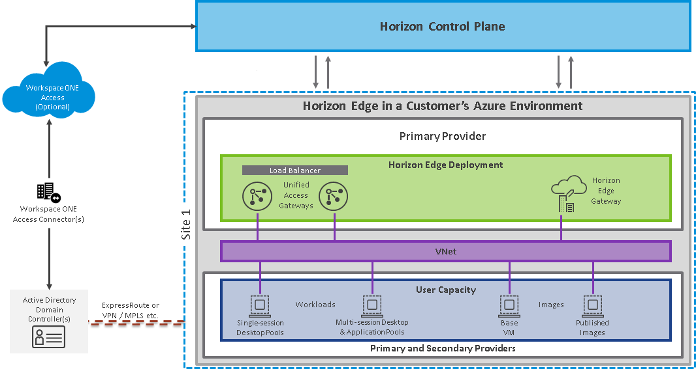
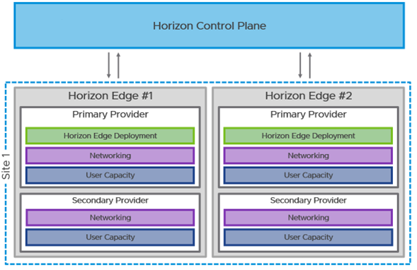
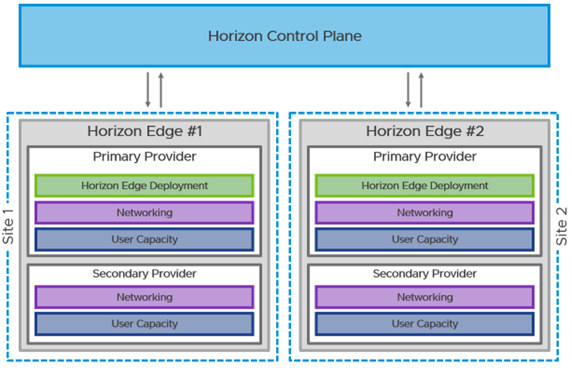
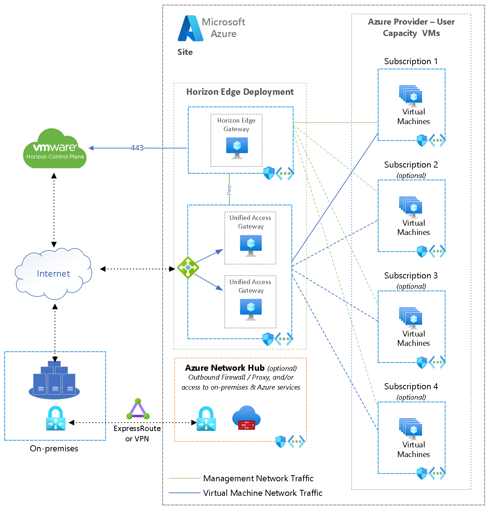
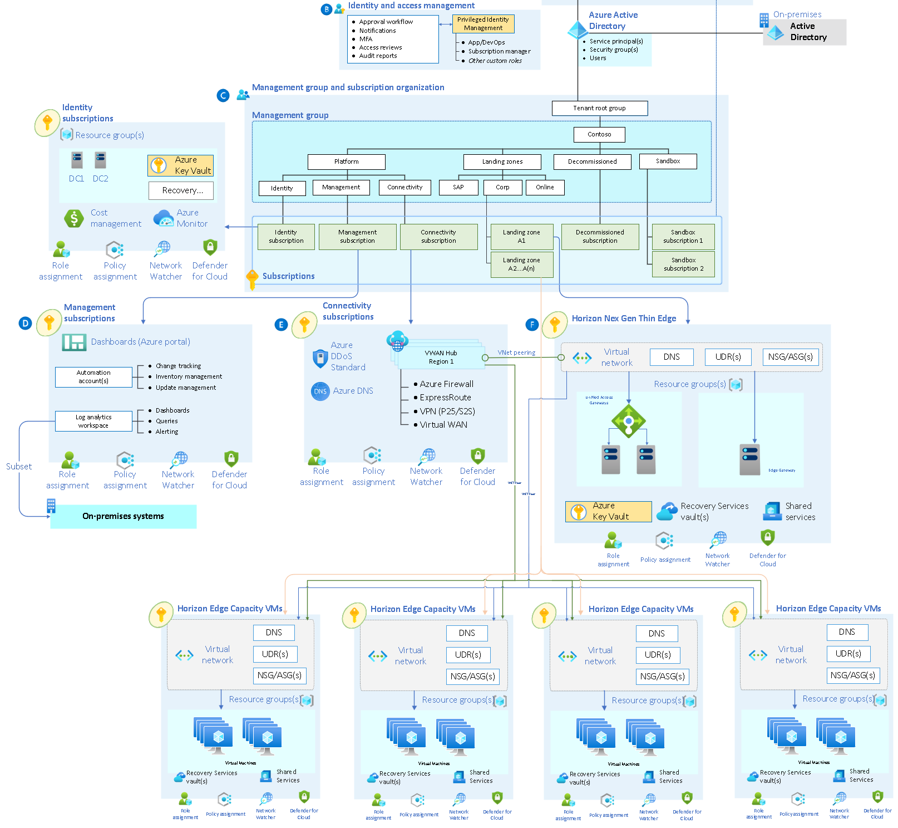
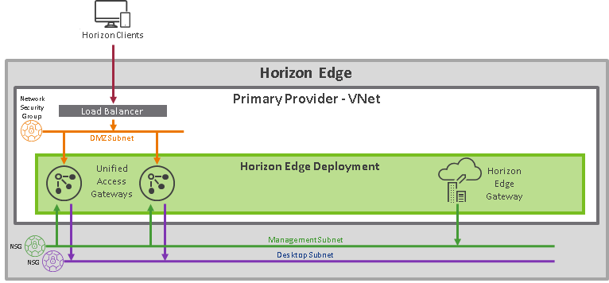

# Disclaimer
Please Note that Horizon Landing Zone Accelerator IS STILL A WORK IN PROGRESS!   Periodically, we will be tweaking things and making changes–so expect to be surprised periodically as we do our best to make the LZ content better for all of you. Thank you for your understanding and please feel free to open Git issues with feedback/suggestions.

# Adopt the VMware Horizon Cloud Next-Gen and Azure Landing Zone Accelerator

VMware and Microsoft partnered together to accelerate the future of work. Employees need a consistent experience and seamless access to the applications and insights vital to doing their best work wherever work needs to get done – in the office, on the road, or at home.
Horizon Cloud Next-Gen offers flexible deployment options across private and public clouds, from on-premises to Microsoft Azure, and other cloud providers, enabling hybrid and multi-cloud architectures. Always up-to-date services in the Horizon Control Plane connect entitlement and management layers across Horizon sites, and edge deplolyments in different datacenters and clouds, addressing challenges such as monitoring and image, application, and lifecycle management.
The reference implementation below adheres to the architecture and best practices of the Microsoft Cloud Adoption Framework's Azure landing zones with a particular focus on the enterprise-scale design principles as well as best practices from VMware for Horizon on Azure deployments.  Although this implementation can be deployed in any Azure environment that complies with the [prerequisites](https://docs.vmware.com/en/VMware-Horizon-Cloud-Service---next-gen/services/hzncloud.nextgen/GUID-63AB2398-E82F-4EF2-BC7F-145D79E28769.html), it is recommended to use this solution after implementing an enterprise-scale landing zone for Horizon. To ensure a secure and properly functioning environment, both [Azure Enterprise Scale Landing Zone Architectural guidance](https://learn.microsoft.com/azure/cloud-adoption-framework/ready/landing-zone/) and [VMware Horizon Cloud Next-Gen](https://docs.vmware.com/en/VMware-Horizon-Cloud-Service---next-gen/services/hzncloud.nextgen/GUID-6E1B1AEA-67A5-4255-A4BD-EE2F80511E1D.html) deployment document should be reviewed thoroughly prior to standing up a Horizon environment. The rest of this document walks you through an architectural overview, and key design areas you should consider when deploying Horizon Cloud Next-Gen on Azure.

NOTE:  This docuemnt is inteded to give guidance on best practices for Horizon Cloud Service Next-Gen on Azure. It does not explore an on premises or Azure VMware Services deployment of VMware Horizon 8. Please see the [Horizon 8 documentation page](https://techzone.vmware.com/resource/horizon-architecture#architectural-overview) for more detail on the Horizon 8 deployment options.  

# Design Considerations and Recommendations

## Customer Profile
Consider the Horizon Next Gen on Azure solution if:

- You plan to deploy Horizon Cloud Service Next-Gen in your Azure environment 
- Want to take advantage of VMware's thin edge deployment to simplify your cloud deployment
- Your business leverages multiple cloud platforms for hosting critical applications on virtual desktop infrastrucutre

## Design Scenarios

### Scenario 1: Horizon Next-Gen Cloud deployment on Microsoft Azure
Horizon Cloud Service provides a single cloud control plane, run by VMware, that enables the central orchestration and management of remote desktops and applications in your Microsoft Azure capacity, in the form of one or multiple subscriptions in [Microsoft Azure](https://azure.microsoft.com/overview/what-is-azure/).
VMware is responsible for hosting the Horizon Cloud Service control plane and providing feature updates and enhancements for a software-as-a-service experience. The Horizon Cloud Service is an application service that runs in multiple Microsoft Azure regions.
Customers are responsible for hosting an Azure Environment (Tenant and Subscriptions) and providing the necessary, network, security, and identity services for the Horizon environment. 
The deployment is straightforward: You prepare and provide information to the VMware Horizon Service about your Microsoft Azure Landing Zone (Identity, networking, subscriptions, etc.), and the Horizon Service deploys a Horizon Cloud Next-Gen components into the Microsoft Azure subscription on your behalf. You may decide to leverage a single or multiple [Microsoft Azure Regions](https://azure.microsoft.com/explore/global-infrastructure/geographies/#overview). More on Hybrid and multi site deployments are below. 
Details on basic network design, single-site design, and multi-site design can be found in the respective sections of the Horizon Cloud on Microsoft Azure Architecture document on VMware [TechZone](https://techzone.vmware.com/resource/horizon-cloud-service-next-gen-architecture#scaling-and-availability).
Sizing and scaling detail can also be found in the [Vmware Horizon Cloud Service on Microsoft Azure Service Limits](https://techzone.vmware.com/resource/horizon-cloud-service-next-gen-architecture#microsoft-azure-deployment-scaling-overview) article in the product documentation.

&nbsp;

**Horizon Cloud on Azure Next-Gen - Deployment Reference Architecture Single Azure Site**

&nbsp;

  
You can find more details on what a typical Horizon Cloud on Microsoft Azure deployment looks like by reviewing the [Horizon Cloud on Microsoft Azure Architecture](https://techzone.vmware.com/resource/horizon-cloud-service-next-gen-architecture) document on VMware TechZone.
Below is a simple example of site scaling and Multi-site deployments. More information can be found at [Horizon Cloud Service - next-gen Architecture | VMware](https://techzone.vmware.com/resource/horizon-cloud-service-next-gen-architecture#single-horizon-edge-scaling)

&nbsp;
  

**Site Scaling architecture - single region**

&nbsp;

  

**Site Scaling architecture - multi region**

&nbsp;

### Scenario 2: Horizon Next-Gen Cloud Hybrid deployment on Microsoft Azure and On Premises ###
Sometimes business requirements dictate that a desktop platform needs to have a hybrid architecture for users/clients that access sensitive data which must be stored and accessed from on premises resources. VMware Horizon Cloud Next-Gen resources can be deployed in multiple locations including on premises datacenters using the above reference multi-site design. Both cloud and on premises deployment can be managed by the same Horizon Cloud Next-Gen control plane hosted by VMware. Some other areas that can be addressed in a hybrid deployment are:
- **Business continuity and disaster recovery** - Leverage the elasticity of the cloud and get a cost-effective, robust DR solution
- **Datacenter extension** - Quickly and easily expand the datacenter without CapEx investment
- **Application co-location** - Co-locate virtual desktops and applications with datacenter workloads

Designing a multi-cloud solution is challenging and complex. VMware has developed guidance for deploying Horizon on each of the supported cloud-based infrastructure platforms. Review the different reference architectures for other platforms on the [Horizon Reference Architecture](https://techzone.vmware.com/resource/horizon-cloud-service-next-gen-architecture) on VMware TechZone.

&nbsp;
&nbsp;

  

**Azure Architecture - Single Site**

&nbsp;
&nbsp;

  

**Azure Architecture - Enterprise Scale Landing Zone View**

&nbsp;
&nbsp;

# Design Areas
&nbsp;

## Networking
Microsoft Horizon Cloud on Microsoft Azure Architecture requires at least one [Microsoft Azure Virtual Network (Vnet)](https://docs.microsoft.com/azure/virtual-network/virtual-networks-overview) to deploy platform and user components onto. This Vnet should contain at least three different subnets for management components of the service, a DMZ, and desktop capacity.
These subnets are used for the Horizon management appliances and customer-managed workload. Network security group (NSG) policies are applied on the Vnet, to allow and disallow traffic in and out of that Vnet.
You can select which VNets and subnets are allowed to be used for desktop capacity. If you are using multiple VNets for user capacity, you need to set up virtual networking peering between the VNets in use. See [Virtual network peering](https://docs.microsoft.com/en-us/azure/virtual-network/virtual-network-peering-overview).

**Horizon Cloud on Azure - Network Reference Architecture**

A detailed list of infrastructure requirements can be found in the Horizon Cloud on Microsoft Azure product documentation in the [Horizon Cloud Next-Gen on Microsoft Azure – First Pod Deployment – High-Level Workflow document](https://docs.vmware.com/en/VMware-Horizon-Cloud-Service---next-gen/services/hzncloud.nextgen/GUID-67DE260B-6B78-48C0-A483-428642129B92.html).

&nbsp;

## Identity and access management
One method of accessing Horizon desktops and applications is through Workspace ONE Access. This requires integration between the Horizon Cloud Service and Workspace ONE Access using the SAML 2.0 standard to establish mutual trust, which is essential for single sign-on (SSO) functionality.

Horizon Cloud on Microsoft Azure allows you to leverage Active Directory or Workspace ONE Access as an identity provider for users of the service. You can integrate your Horizon Cloud Service tenant with your Workspace ONE Access tenant to provide users with the ability to access Horizon Cloud desktops and applications from the Workspace ONE Intelligent Hub app and portal. This lets you provide users with a single place to access all their applications securely from multiple devices. Note that Workspace ONE Access integrates with Microsoft Entra ID. See the [Platform Integration notes in the Reference Architecture](https://techzone.vmware.com/resource/service-integration#enterprise-productivity-service) for details.

- Horizon Cloud on Microsoft Azure has built-in Single Sign-On capabilities via the True SSO feature. Architectural details about how True SSO can be implemented in Horizon Cloud on Microsoft Azure can be found in the [Reference Architecture](https://techzone.vmware.com/resource/horizon-cloud-on-microsoft-azure-architecture#true-sso). Details on leveraging True SSO to provide a single sign-on experience with Horizon Cloud on Microsoft Azure can be found in [Configure True SSO for Use with your Horizon Cloud Environment](https://docs.vmware.com/en/VMware-Horizon-Cloud-Service/services/hzncloudmsazure.admin15/GUID-451AF252-931C-418C-BD7F-288AE170F5A4.html).
- By default, Horizon Cloud on Microsoft Azure uses Active Directory for user access. Configuring it to use Workspace ONE Access is covered in [Identity Management Page in the Horizon Universal Console](https://docs.vmware.com/en/VMware-Horizon-Cloud-Service/services/hzncloudmsazure.admin15/GUID-49E2E9C3-222E-4200-9AD4-75B3D01211F4.html).

**Recommended Content**
The following list provides more information about platform-based resources:

- [Providing Access to VMware Horizon Cloud Service Desktops and Applications in Workspace ONE Access](https://docs.vmware.com/en/VMware-Workspace-ONE-Access/services/ws1-access-resources/GUID-361DF7AB-D944-4E87-8F6E-7F0425D23ACD.html) – Explains how to configure Workspace One for use with Horizon Cloud Service

Typically, Horizon Cloud on Microsoft Azure integrates with Microsoft Entra ID or Workspace ONE Access for identity services. If you need to integrate a 3rd party prover like OKTA or OpenLDAP you can consider using Workspace ONE Access which has the ability to integrate with other LDAP providers.
Resources Review the following resources on Identity integration.
- [Workspace ONE Access](https://docs.vmware.com/en/VMware-Workspace-ONE-Access/index.html)
- [Workspace ONE Access - Directory Integration](https://docs.vmware.com/en/VMware-Workspace-ONE-Access/services/ws1_access_directory/GUID-DF53F9EF-6715-469A-A885-9ACFE4B2A35B.html)
- [Horizon Cloud on Azure Architecture](https://techzone.vmware.com/resource/horizon-cloud-on-microsoft-azure-first-gen-architecture#authentication)

&nbsp;

## Security
All environments should follow, at a minimum, Microsoft's [Cloud Adoption Framework guidance for security](https://learn.microsoft.com/azure/cloud-adoption-framework/secure/security-best-practices-introduction). There are also other considerations in the Network, Identity, and management sections that will help lock down your environmnet from outside influence. Security reviews, and updates should be part of regular maintennace of your environment.  

•	[Horizon Cloud Service on Microsoft Azure Security Considerations](https://www.vmware.com/content/dam/digitalmarketing/vmware/en/pdf/products/horizon/vmw-wp-horizon-cloud-microsoft-azure-uslet-white-paper.pdf) – This article contains information about the security details of the platform environment and the types of data stored.
•	[Horizon Cloud Pod – Ports and Protocols Requirements](https://docs.vmware.com/en/VMware-Horizon-Cloud-Service/services/hzncloudmsazure.getstarted15/GUID-FE6A6C12-2A0A-4C2D-B578-F1D65475801A.html) – This page is a reference for all of the possible ports and protocols used for communication within a typical Horizon Cloud Service on Microsoft Azure deployment. Use these tables to ensure your network configuration and firewalls will allow the communication traffic that is required for a successful pod deployment and day-to-day operations.
•	[Horizon Client and Agent Security](https://docs.vmware.com/en/VMware-Horizon/2209/horizon-security/GUID-C4781600-9941-4576-8D81-C2E63A850EE7.html) – Horizon Client is the client software that end users run on their client devices to connect to remote desktops and published applications. Horizon Agent is the agent software that runs in virtual desktops, and on Microsoft RDS hosts that provide published desktops and published applications. Guidance on securing endpoints and virtual machines can be found in the document linked.

&nbsp;

## Resource Organization
Horizon Cloud on Microsoft Azure automatically configures and manages all the critical platform components that it creates on your behalf within Microsoft Azure.
Platform-Based Resources
The following list provides more information about platform-based resources created by Horizon Cloud Next-Gen:
- [Resource Groups](https://docs.vmware.com/en/VMware-Horizon-Cloud-Service/services/hzncloudmsazure.admin15/GUID-9F004F77-5685-400E-8ADC-3ECA96D3CA71.html) are automatically created for each pod to manage Azure Resources.
- Default [Network Security Group Rules](https://docs.vmware.com/en/VMware-Horizon-Cloud-Service/services/hzncloudmsazure.admin15/GUID-202BDE8E-48BE-457A-AD96-8A866D935FDD.html#GUID-202BDE8E-48BE-457A-AD96-8A866D935FDD) are created to manage communications between pod components.

**User Resources**
User resources are organized and displayed in the Horizon Universal Console for administrators to manage. After a Horizon Edge or Horizon Pod has been deployed, you can import images, use them to create pool templates, pools, and entitle users to desktops and applications.

&nbsp;

## Images
Golden images are fundamental to the creation of desktop pools and RDS server farms. The Horizon Image Management Service can be used to create, customize, and publish golden image versions across your cloud-managed edge deployments. See [Managing Horizon Images from the Cloud](https://docs.vmware.com/en/VMware-Horizon-Cloud-Service---next-gen/services/hzncloud.nextgen/GUID-5BE14BDA-F86F-4D99-865A-15F97DC54B8F.html) for more information.

With Horizon Edge deployments on cloud-native providers, the platform cloud services can be used to import a suitable image that can then be customized and used in pool and farm creation.

You use this service to create, customize, and publish image versions for desktop and server entitlements across your cloud-managed edge deployments.

The Horizon work flow depends upon the prompt administration of the system images. The system images power up the virtual machines, which provision entitlements to end users. To manage system images, every image customization needs the administrator to add and publish new versions of an image, and update the associated entitlements individually.

Horizon Image Management Service simplifies and streamlines this process by offering the following features and benefits across your cloud-managed edge deployments.

- Centralized image catalogs, listing the images with their versions and copies across edges.
- Easy-to-use guided steps to publish an image.
- Entitlements on different cloud-connected edges and sites, which can easily and consistently use the same image version managed by the image service.
- Simplified image conversioning to control and track customizations.

For Azure-based deployments of Horizon Edge, see [Images with Microsoft Azure Deployments](https://techzone.vmware.com/resource/horizon-cloud-service-next-gen-architecture#images-with-microsoft-azure-deployments).
When an image is ready to use you publish it to the Horizon Edges where you want to use it. Publishing an image to a Horizon Edge copies the image to each provider in that edge making it available for use in creating pools of virtual machines on that edge, and in any provider capacity assigned to that edge.

When the Horizon Edge deployment is on Azure, a virtual machine image can be imported from the Microsoft Azure Marketplace, the Microsoft Azure Compute Gallery, or from a Microsoft Azure Custom VM. After it is imported, you can remotely connect to the image and make changes such as installing applications.

**Recommended Content**
https://techzone.vmware.com/resource/horizon-cloud-service-next-gen-architecture#image-management-service

&nbsp;

## Applications & Desktop Experience
**Application Volume Packages**
[VMware App Volumes™](https://techzone.vmware.com/resource/horizon-cloud-service-next-gen-architecture#app-volumes) allows for the separation of applications from the OS image, simplifying application management with real-time application delivery, and one-to-many provisioning. App Volumes functionality is available in Horizon Cloud Service – next gen. App Volumes management components are provided as part of the cloud service, and App Volumes agents and packages reside in the deployed Horizon Edge.

App Volumes provides the delivery of software programs that are not in the golden image VM image for VDI and RDSH. This is a different way of doing things, which enables you to clean up your golden desktop image and manage it separately from the applications that are installed.
Using App Volumes applications functionality, you can manage the entire life cycle of applications, including packaging, updating, and retiring an application. You can also customize application assignments to deliver specific versions of an application to end users.
- **Packages** - App Volumes groups one or more programs into packages, based on the requirements of each use case. A package is a virtual disk containing one or more programs that are captured together.
- **Applications** – An Application contains one or more Package, where each represents a different version of the Application and the programs in contains. Users and groups are entitlements are to an Application.

See link below for more detail on use App Volumes with Horizon Next-Gen.

In some cases it also can make sense to [integrate App Volumes with FSlogix](https://techzone.vmware.com/resource/integrating-fslogix-profile-containers-vmware-horizon#_Toc50543897). Please see the linked document for more detail 

**Desktop and User Experience**
Regardless of the provisioning technology you choose (desktop or published application) or the type of desktop, a persistent user experience is about the way end users perceive their experience. From the end user’s perspective, it should feel like the session they use from day to day is always coming from the same VM. Settings, applications, and data persist from session to session, whether end users are accessing the same VM guest OS or not.

Being able to dynamically apply saved profile settings that follow end users across devices and locations for a personalized desktop experience with every login is a critical feature for any remote desktop and application service implementation.
VMware Dynamic Environment Manager delivers personalization and centrally managed policy configurations across virtual, physical, and cloud-based Windows desktop environments. IT administrators control which settings users are allowed to personalize, and administrators can map environmental settings such as network drives and location-specific printers.

User-specific Windows desktop and application settings can be applied in the context of client device, location, or other conditions. Policies are enforced when users log in, launch an app, reconnect, or when some other triggering event occurs. Dynamic Environment Manager also has a feature for configuring folder redirection for storing personal user data, including documents, pictures, and so on.

**Recommended Content**
The resources below describe how resources are managed within Horizon Cloud on Microsoft Azure:
- [Pools, Pool Groups, and Apps](https://techzone.vmware.com/resource/horizon-cloud-service-next-gen-architecture#pools-pool-groups-and-apps)
- [App Volumes](https://techzone.vmware.com/resource/horizon-cloud-service-next-gen-architecture#app-volumes)
-	[Horizon Control Plane Services Architecture – Image Management Service](https://techzone.vmware.com/resource/horizon-cloud-service-next-gen-architecture#image-management-service) – Learn how to manage golden images for virtual desktops and session or application hosts across pods with automatic replication and simplified pool or assignment updates.
-	[Integrating FSLogix Profile Containers with VMware Horizon](https://techzone.vmware.com/resource/integrating-fslogix-profile-containers-vmware-horizon) – This document describes a number of different strategies for integrating FSLogix Profile Containers into a VMware Horizon deployment.
-	[Managing Profiles and Policies for Windows Desktops: Dynamic Environment Manager Operational Tutorial](https://techzone.vmware.com/managing-profiles-and-policies-windows-desktops-dynamic-environment-manager-operational-tutorial) – Learn how to leverage Dynamic Environment Manager to manage Windows profiles and policies.

&nbsp;

## Business Continuity and Disaster Recovery
Organizations depend on Horizon to deliver key services to users. Proper design of the Horizon implementation can provide disaster recovery (DR) capabilities to ensure availability, recoverability, and business continuity.

Disaster recovery for Horizon workloads should be viewed from the perspective of the users. Where a user is being delivered Horizon-based desktops or published applications from a particular location, contingencies should be made to provide equivalent services from a separate location.

A remote-first approach that relies on physical desktops is challenging and introduces many operational and security concerns. Providing disaster recovery for physical desktops is difficult, especially when combined with the need for the flexibility of a remote-first experience.

By contrast, Horizon allows flexibility for providing disaster recovery to desktops and applications.
- Horizon is designed to allow users a remote and roaming experience, where they can access their desktop and applications from any device in any permitted location.
- Horizon abstracts the desktop from the physical device. This allows the components that make up a user’s desktop and data to be replicated to alternative data centers or locations to provide site resiliency and disaster recovery.
- Horizon offers multiple deployment options, from on-premises data centers to running in a variety of cloud platforms. This offers flexibility with regard to the consumption model and choice about the location of recovery services.

**Recommended Content**
The resources below may be useful for designing a resilient virtual workspace and applications environment with Horizon Cloud on Microsoft Azure:
[Disaster Recovery in VMware Horizon](https://techzone.vmware.com/resource/providing-disaster-recovery-vmware-horizon#disaster-recovery-in-horizon-design) – This guide covers the considerations and discusses how to approach providing disaster recovery for Horizon-based workloads

&nbsp;

## Management

You can use a variety of procedures for monitoring, diagnosing, and fixing problems that you might encounter when using VMware Horizon. Horizon Cloud on Microsoft Azure comes with built-in monitoring and reporting features.
To maintain the health and efficient operation of any VDI platform, it is important to monitor for availability of critical platform and infrastructure components. Every Virtual Workspace implementation is unique, bult on unique infrastructure implementations based on organizational requirements. It is critical to understand that a virtual workspace solution is reliant on all the infrastructure and environmental resources being available performant and secure.

There are three components used for monitoring in the Horizon Cloud Service.

- Horizon Infrastructure Monitoring – Monitors all of the critical components of a Horizon deployment along with critical infrastructure components (such as DNS).
- User Monitoring – Monitors individual session and virtual desktop usage by end-user to provide details use for troubleshooting purposes.
- User Capacity Monitoring and Metrics - Monitors the health and performance of all end-user capacity (virtual machines). Monitoring data is collected by Horizon Agents, and other managed Horizon Cloud Service – next-gen resources, located in customer environments and sent to the Horizon Edge Gateway.  From there the monitoring data is handled differently based on license entitlement.

The the [Tracking Monitoring Events page](https://docs.vmware.com/en/VMware-Horizon-Cloud-Service---next-gen/services/hzncloud.nextgen/GUID-956DE018-E8F3-4144-BE76-1FA1645BDF4F.html) for more detail on Monitoring a Horizon Next-Gen environment. 

**Design Recommendations**
The following list of basic platform and infrastructure monitoring metrics should be measured and monitored for a healthy implementation.

Metrics and Alert Thresholds
The following list of common metrics should be monitored for any Horizon Cloud on Microsoft Azure environment. The list is not exhaustive but is compiled from a list of monitoring metrics available within the Horizon Cloud on Microsoft Azure platform.
Note that thresholds for metrics should be set based on differentiated values for expected norms in most situations. Resource-based metrics should be measured as a percentage of capacity of the given resource versus the total capacity available for that resource.
- End-User Connection Statistics
- Successful Connections
- Unsuccessful Connections
- End User Experience Statistics
- Session Latency
- Protocol Latency
- Packet Loss
- Average Logon Execution Time
- Platform Metrics
- Number of Unique Users
- Number of User Sessions
- Number of VDI Sessions
- Number of Shared-Desktop Sessions
- Number of Application Sessions
- Number of currently Active Sessions
- Number of users impacted by User Experience issues (see above list)
- User distribution across Horizon Pods
- Number of available desktops
- Number of available muti-user farms
- User Metrics
- User resource consumption (CPU, Memory, Disk IOPS)
- User bandwidth consumption
- Number of active sessions
- Number of active desktops
- Number of active applications
- Login Time
- Client Information
- Process / Application Information
- Infrastructure
- Critical Network services Available
- DNS, DHCP, NTP
- Active Directory
- Network connectivity
- User Connectivity
- Critical Platform components available
- Network Throughout
- Network Latency
- Storage Throughput
- Storage Latency

  
**Recommended Content**

The resources below describe how resources are managed within Horizon Cloud on Microsoft Azure:

- [Horizon Cloud Service – Monitoring Dashboard](https://docs.vmware.com/en/VMware-Horizon-Cloud-Service/services/hzncloudmsazure.admin15/GUID-86BBC3B3-31B6-4F96-98C6-A6CED86A8E39.html) – The Horizon Cloud Service has several built-in dashboards to help provide at-a-glance notifications about system, configuration, and infrastructure status.
- [Horizon Cloud Service - next-gen Architecture - Management and Moitoring](https://techzone.vmware.com/resource/horizon-cloud-service-next-gen-architecture#monitoring-and-analytics-service)

&nbsp;

## Governance
In Horizon Cloud Next Gen, the pod management and database functions move into the Horizon control plane, thus introducing the concept of the Horizon Edge. Each edge can scale to 20K sessions, it is equipped with the proactive monitoring we previously pointed out as well as the API integration and automation

In Horizon Cloud Next-Gen Edge deployments, Providers, Service Principals and Sites can be used for scaling out an environment. Providers are supported hypervisors and cloud platforms that offer the necessary resource capacity to provision and deliver desktops and applications to end users. Multiple Service Principals are required for Azure deployments larger than 1,000 VMs or users. Sites are a logical grouping of Horizon Edge(s) to define from where end users can source capacity.

&nbsp;

### Tagging
Tagging is an important part of any cloud strategy. When you apply metadata tags to your cloud resources, include information that couldn't be included in the resource name. For example, include information about the asset. You can use that information to run more sophisticated filtering and reporting on resources. You want these tags to include context about the resource's associated workload or application, operational requirements, and ownership information. IT or business teams use this information to find resources or generate reports about resource usage and billing.

Tagging is built into the Horizon Cloud Service Next-Gen design. Customer should develop a robust tagging strategy for use with Horizon Cloud Next-Gen. Check out the [Azure Cloud Adoption Framework Tagging page](https://learn.microsoft.com/azure/cloud-adoption-framework/ready/azure-best-practices/resource-tagging) for best practices around tagging Azure resources. 

&nbsp;

**Recommended Content**
&nbsp;
Review the following resources to find security controls and governance details for your Horizon Cloud on Microsoft Azure deployment. Most of the design considerations and recommendations for this topic can be found in these assets.
- [Introduction to Using VMware Horizon Cloud Service - next-gen](https://docs.vmware.com/en/VMware-Horizon-Cloud-Service---next-gen/services/hzncloud.nextgen/GUID-6E1B1AEA-67A5-4255-A4BD-EE2F80511E1D.html) – This article discusses the new Horizon Cloud updates. With Horizon Cloud, you have a global view of your desktops and applications spanning your cloud-connected Horizon deployments.
- [Deploying a Horizon 8 Edge for Use with Horizon 8 Deployments and the Horizon Cloud](https://docs.vmware.com/en/VMware-Horizon-Cloud-Service---next-gen/services/hzncloud.nextgen/GUID-EDA62396-F36E-4A01-8442-A57E7A62ECE2.html) - next-gen Control Plane (vmware.com)– This documentation page describes the Horizon Universal Console Add Horizon Edge workflow steps for the use case where you are creating a Horizon Edge that uses a Horizon 8 pod as its resource provider and that pod is in a vSphere environment (an on-premises or all-in-SDDC deployment). Only one Horizon Connection Server pod is supported on a Horizon Edge.
- [Managing Your Horizon Cloud Tenant Environment](https://docs.vmware.com/en/VMware-Horizon-Cloud-Service---next-gen/services/hzncloud.nextgen/GUID-DC2B3802-3F0A-46FA-9130-46242A10093A.html)
