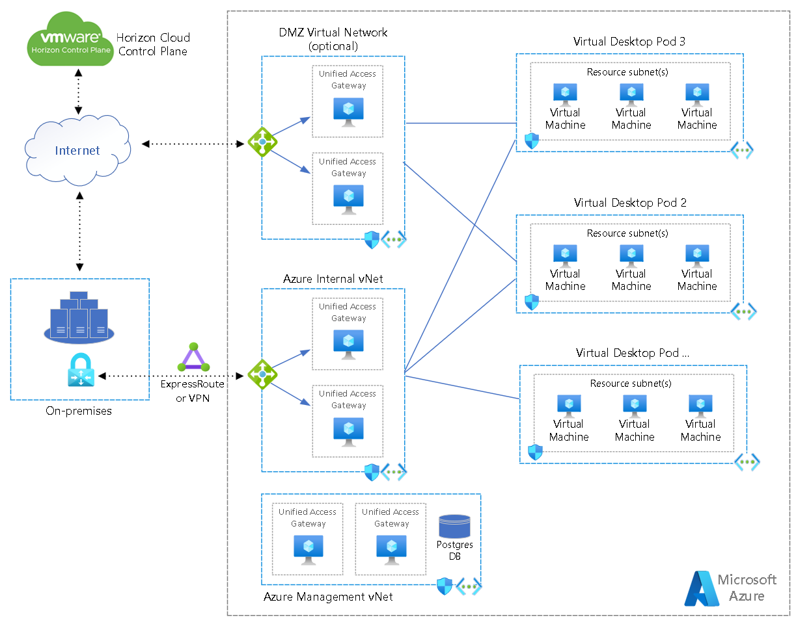
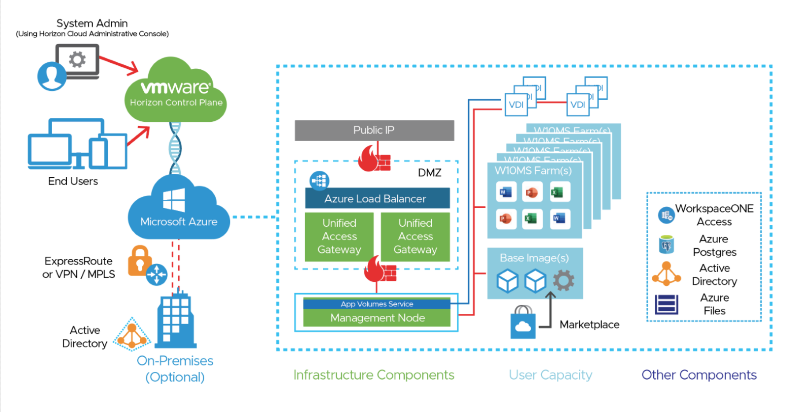
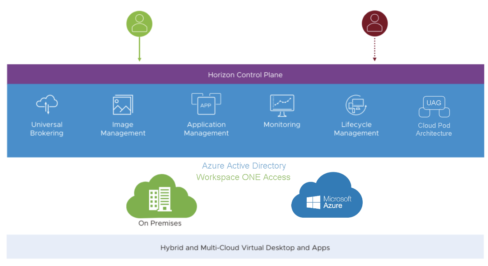

# Disclaimer
Please Note that Horizon Landing Zone Accelerator IS STILL A WORK IN PROGRESS!   Periodically, we will be tweaking things and making changes–so expect to be surprised periodically as we do our best to make the LZ content better for all of you. Thank you for your understanding and please feel free to open Git issues with feedback/suggestions.

# Adopt the Horizon Cloud and Azure Landing Zone Accelerator

VMware and Microsoft partnered together to accelerate the future of work. Employees need a consistent experience and seamless access to the applications and insights vital to doing their best work wherever work needs to get done – in the office, on the road, or at home.

This reference implementation adheres to the architecture and best practices of the Cloud Adoption Framework's Azure landing zones with a particular focus on the enterprise-scale design principles. Although this implementation can be deployed in any Azure environment that complies with the [prerequisites](https://github.com/Azure/avdaccelerator/blob/main/workload/docs/getting-started-baseline.md#prerequisites), It is recommended to use this solution after implementing an enterprise-scale landing zone, [enterprise-scale overview](../../ready/enterprise-scale/index.md) and [implementation guidance](../../ready/enterprise-scale/implementation.md) before deploying the enterprise-scale for Desktop Virtualization solution.

# Design areas – Identity and access management 
One method of accessing Horizon desktops and applications is through Workspace ONE Access. This requires integration between the Horizon Cloud Service and Workspace ONE Access using the SAML 2.0 standard to establish mutual trust, which is essential for single sign-on (SSO) functionality. 

### Identity and Access Management Design Considerations and Recommendations
Horizon Cloud on Microsoft Azure allows you to leverage Active Directory or Workspace ONE Access as an identity provider for users of the service. You can integrate your Horizon Cloud Service tenant with your Workspace ONE Access tenant to provide users with the ability to access Horizon Cloud desktops and applications from the Workspace ONE Intelligent Hub app and portal. This lets you provide users with a single place to access all their applications securely from multiple devices.
Note that Workspace ONE Access integrates with Azure AD. See the [Platform Integration notes in the Reference Architecture](https://techzone.vmware.com/resource/service-integration#enterprise-productivity-service) for details. 

- Horizon Cloud on Microsoft Azure has built-in Single Sign-On capabilities via the True SSO feature. Architectural details about how True SSO can be implemented in Horizon Cloud on Microsoft Azure can be found in the [Reference Architecture](https://techzone.vmware.com/resource/horizon-cloud-on-microsoft-azure-architecture#true-sso). Details on leveraging True SSO to provide a single sign-on experience with Horizon Cloud on Microsoft Azure can be found in [Configure True SSO for Use with your Horizon Cloud Environment](https://docs.vmware.com/en/VMware-Horizon-Cloud-Service/services/hzncloudmsazure.admin15/GUID-451AF252-931C-418C-BD7F-288AE170F5A4.html).

- By default, Horizon Cloud on Microsoft Azure uses Active Directory for user access. Configuring it to use Workspace ONE Access is covered in [Identity Management Page in the Horizon Universal Console](https://docs.vmware.com/en/VMware-Horizon-Cloud-Service/services/hzncloudmsazure.admin15/GUID-49E2E9C3-222E-4200-9AD4-75B3D01211F4.html). 

### Recommended Content
The following list provides more information about platform-based resources: 

- [Providing Access to VMware Horizon Cloud Service Desktops and Applications in Workspace ONE Access](https://docs.vmware.com/en/VMware-Workspace-ONE-Access/services/ws1-access-resources/GUID-361DF7AB-D944-4E87-8F6E-7F0425D23ACD.html) – Explains how to configure Workspace One for use with Horizon Cloud Service 

- [Design areas – Network topology and connectivity](https://learn.microsoft.com/azure/cloud-adoption-framework/scenarios/wvd/eslz-network-topology-and-connectivity) – Describes several Cloud Adoption Framework enterprise-scale landing zone’s architectural principles and recommendation to manage network topology and connectivity at scale. 

### Customer Profile
Consider the Horizon solution if: 
- You have already deployed VMWare Horizon on-premises and would like to continue to use the same platform in the future 
- You have decided on VMWare Horizon as your new desktop platform and wish to deploy into Azure or in a hybrid cloud model
- You wish to have a single control plane to manage Horizon on Azure or a hybrid deployment of Horizon 
- Critical applications or services are identified that will remain on-premises, in Azure, or in other cloud or hosted infrastructure platforms
- Your business leverages multiple cloud platforms for hosting critical applications
- Diverse user population requires access to services from anywhere

# Architectural Components
- Horizon Cloud on Microsoft Azure Architecture requires at least one [Microsoft Azure Virtual Network (Vnet)](https://docs.microsoft.com/azure/virtual-network/virtual-networks-overview) to deploy platform and user components onto. This Vnet should contain at least three different subnets for management components of the service, a DMZ, and desktop capacity. 

- These subnets are used for the Horizon management appliances and customer-managed workload. Network security group (NSG) policies are applied on the Vnet, to allow and disallow traffic in and out of that Vnet, and to segregate that network into subnets. 

- You can select which Vnets and subnets are allowed to be used for desktop capacity. If you are using multiple Vnets for user capacity, you need to set up virtual networking peering between the Vnets in use. See [Virtual network peering](https://docs.microsoft.com/en-us/azure/virtual-network/virtual-network-peering-overview). 

**Horizon Cloud on Azure - Network Reference Architecture**

Details on network topology and connectivity for each platform are discussed below. 

A detailed list of infrastructure requirements can be found in the Horizon Cloud on Microsoft Azure product documentation in the [Horizon Cloud on Microsoft Azure – First Pod Deployment – High-Level Workflow](https://docs.vmware.com/en/VMware-Horizon-Cloud-Service/services/hzncloudmsazure.getstarted15/GUID-F2A692EB-25B7-4208-AF89-23691F5B85D8.html) document. 

# Scenario 1: Single cloud Infrastructure use with Microsoft Azure 

Horizon Cloud Service provides a single cloud control plane, run by Vmware, that enables the central orchestration and management of remote desktops and applications in your Microsoft Azure capacity, in the form of one or multiple subscriptions in [Microsoft Azure](https://azure.microsoft.com/overview/what-is-azure/). 

Vmware is responsible for hosting the Horizon Cloud Service control plane and providing feature updates and enhancements for a software-as-a-service experience. The Horizon Cloud Service is an application service that runs in multiple Microsoft Azure regions. 

**Horizon Cloud on Azure - Deployment Reference Architecture**

You can find more details on what a typical Horizon Cloud on Microsoft Azure deployment looks like by reviewing the [Horizon Cloud on Microsoft Azure Architecture](https://techzone.vmware.com/resource/horizon-cloud-on-microsoft-azure-architecture) document on Vmware TechZone. 

## Design Considerations and Recommendations 

Horizon Cloud on Microsoft Azure is a simple solution for providing desktops and streamed applications to your end users. The deployment is straightforward: You prepare and provide information to Vmware on a Microsoft Azure subscription, and the Horizon Service deploys a Horizon Cloud on Microsoft Azure pod into the subscription on your behalf. You may decide to leverage a single or multiple [Microsoft Azure Regions](https://azure.microsoft.com/explore/global-infrastructure/geographies/#overview) to deploy Horizon Cloud on Microsoft Azure Pods into.  

Details on basic [network design](https://techzone.vmware.com/resource/horizon-cloud-on-microsoft-azure-architecture#network-design), [single-site design](https://techzone.vmware.com/resource/horizon-cloud-on-microsoft-azure-architecture#single-site-design), and [multi-site design](https://techzone.vmware.com/resource/horizon-cloud-on-microsoft-azure-architecture#multi-site-design) can be found in the respective sections of the Horizon Cloud on Microsoft Azure Architecture document on Vmware TechZone.   

Sizing and scaling detail can also be found in the [Vmware Horizon Cloud Service on Microsoft Azure Service Limits](https://docs.vmware.com/en/VMware-Horizon-Cloud-Service/services/hzncloudmsazure.getstarted15/GUID-EE21156D-974D-4C37-820D-1A40CED6346E.html) article in the product documentation.

# Scenario 2: Hybrid Cloud using Horizon and Azure and Horizon on other Cloud Services 
VMware Horizon is a modern platform for secure delivery of virtual desktops and apps across hybrid deployments and multiple clouds to address key hybrid use cases, such as: 

- <b>Business continuity and disaster recovery</b> - Leverage the elasticity of the cloud and get a cost-effective, robust DR solution 
- <b>Datacenter extension</b> - Quickly and easily expand the datacenter without CapEx investment 
- <b>Application co-location</b> - Co-locate virtual desktops and applications with datacenter workloads 

Horizon offers flexible deployment options across private and public clouds, from on-premises to Microsoft Azure, VMware Cloud on AWS, and Google Cloud, enabling hybrid and multi-cloud architectures. Always up-to-date services in the Horizon Control Plane connect entitlement and management layers across Horizon pods in different datacenters and clouds, addressing challenges such as monitoring and image, application, and lifecycle management. 

**Horizon Cloud on Azure Reference Architecture**

## Design Considerations and Recommendations 

Designing a multi-cloud solution is challenging and complex. VMware has developed guidance for deploying Horizon on each of the supported cloud-based infrastructure platforms. Review the different reference architectures for other platforms on the [Horizon Reference Architecture](https://techzone.vmware.com/reference-architecture#horizon) on VMware TechZone. 

# Design area – Identity
Typically, Horizon Cloud on Microsoft Azure integrates with Microsoft Entra ID or Workspace ONE Access for identity services. If you need to integrate a 3rd party prover like OKTA or OpenLDAP you can consider using Workspace ONE Access which has the ability to integrate with other LDAP providers.

Resources
Review the following resources on Identity integration.
- [Workspace ONE Access](https://docs.vmware.com/en/VMware-Workspace-ONE-Access/index.html)
- [Workspace ONE Access - Directory Integration](https://docs.vmware.com/en/VMware-Workspace-ONE-Access/services/ws1_access_directory/GUID-DF53F9EF-6715-469A-A885-9ACFE4B2A35B.html)
- [Horizon Cloud on Azure Architecture](https://techzone.vmware.com/resource/horizon-cloud-on-microsoft-azure-first-gen-architecture#authentication)

# Design area – Resource Organization 
Horizon Cloud on Microsoft Azure automatically configures and manages all the critical platform components that it creates on your behalf within Microsoft Azure. 

## Platform-Based Resources 
The following list provides more information about platform-based resources: 

- [Resource Groups](https://docs.vmware.com/en/VMware-Horizon-Cloud-Service/services/hzncloudmsazure.admin15/GUID-9F004F77-5685-400E-8ADC-3ECA96D3CA71.html) are automatically created for each pod to manage Azure Resources. 
- [Default Network Security Group Rules](https://docs.vmware.com/en/VMware-Horizon-Cloud-Service/services/hzncloudmsazure.admin15/GUID-202BDE8E-48BE-457A-AD96-8A866D935FDD.html#GUID-202BDE8E-48BE-457A-AD96-8A866D935FDD) are created to manage communications between pod components. 

## User Resources
User resources are organized and displayed in the Horizon Universal Console for administrators to manage. After a Horizon Edge or Horizon Pod has been deployed, you can import images, use them to create pool templates, pools, and entitle users to desktops and applications. 

### Images 

A virtual machine image can be imported from the Microsoft Azure Marketplace, the Microsoft Azure Compute Gallery, or from a Microsoft Azure Custom VM. After it is imported, you can remotely connect to the image and make changes such as installing applications. 

When an image is ready to use you publish it to the Horizon Edges where you want to use it. Publishing an image to a Horizon Edge copies the image to each provider in that edge, making it available for use in creating pools of virtual machines on that edge, and in any provider capacity assigned to that edge. 

App Volume Packages 

VMware App Volumes™ is an application packaging solution that provides real-time application delivery and life-cycle management for digital workspaces. App Volumes provides faster application delivery and simplified and unified management of apps and users, while at the same time reducing IT costs. App Volumes does this by abstracting Windows applications from the base operating system and delivering those applications through virtual disks. This is a different way of doing things, which enables you to clean up your golden desktop image and manage it separately from the applications that are installed. 

Using App Volumes applications functionality, you can manage the entire life cycle of applications, including packaging, updating, and retiring an application. You can also customize application assignments to deliver specific versions of an application to end users.  

Note: VMware App Volumes has different implementations and feature sets based on whether you use it with a [Horizon 8](https://techzone.vmware.com/resource/app-volumes-architecture) or a [Horizon Cloud on Microsoft Azure](https://techzone.vmware.com/resource/horizon-cloud-on-microsoft-azure-architecture#app-volumes-packages-in-horizon-cloud-on-microsoft-azure) deployment for your VDI and published desktop environment.  

### Desktop User Resources 

User resources in Horizon Cloud on Microsoft Azure consist of virtual machines created and managed by the service for end-user consumption as either: 

- Single User Desktops (VDI) 
- Multi-User Desktops and Workspaces (Multi-Session Desktops) 
- Applications (RDS Applications and Multi-Session Applications)

## Desktop and User Experience 

Regardless of the provisioning technology you choose (desktop or published application) or the type of desktop, a persistent user experience is about the way end users perceive their experience. From the end user’s perspective, it should feel like the session they use from day to day is always coming from the same VM. Settings, applications, and data persist from session to session, whether end users are accessing the same VM guest OS or not.   

Being able to dynamically apply saved profile settings that follow end users across devices and locations for a personalized desktop experience with every login is a critical feature for any remote desktop and application service implementation. 

VMware Dynamic Environment Manager delivers personalization and centrally managed policy configurations across virtual, physical, and cloud-based Windows desktop environments. IT administrators control which settings users are allowed to personalize, and administrators can map environmental settings such as network drives and location-specific printers. 

User-specific Windows desktop and application settings can be applied in the context of client device, location, or other conditions. Policies are enforced when users log in, launch an app, reconnect, or when some other triggering event occurs. Dynamic Environment Manager also has a feature for configuring folder redirection for storing personal user data, including documents, pictures, and so on. 

## Recommended Content
The resources below describe how resources are managed within Horizon Cloud on Microsoft Azure: 

- [Horizon Cloud on Microsoft Azure Architecture](https://techzone.vmware.com/resource/horizon-cloud-on-microsoft-azure-architecture) – This asset describes the details of an implementation of a Horizon Cloud on Microsoft Azure pod, along with how to expand. It also covers the types of Microsoft Azure resources that it requires. 
- [Introduction to Your Tenant’s Desktop Assignments in based on Horizon Cloud Pods in Microsoft Azure](https://docs.vmware.com/en/VMware-Horizon-Cloud-Service/services/hzncloudmsazure.admin15/GUID-93033B78-1651-4C1A-9010-3D093C7ABB9D.html?hWord=N4IghgNiBcIGYQPZgC4EsB2BzEBfIA) – This article provides an overview of the types of desktop assignments you can create for users with Horizon Cloud in Microsoft Azure. 
- [App Volumes Packages in Horizon Cloud on Microsoft Azure](https://techzone.vmware.com/resource/horizon-cloud-on-microsoft-azure-architecture#app-volumes-packages-in-horizon-cloud-on-microsoft-azure) – This portion of the Horizon Cloud on Microsoft Azure reference architecture explains how App Volumes is implemented and used. 
- [Applications in your Horizon Cloud Inventory](https://docs.vmware.com/en/VMware-Horizon-Cloud-Service/services/hzncloudmsazure.admin15/GUID-6AD2B0E1-94D1-431E-A097-29053235EA69.html) – This article provides a comprehensive overview of the application resources in Horizon Cloud on Microsoft Azure environments. 
- [Horizon Control Plane Services Architecture](https://techzone.vmware.com/resource/horizon-control-plane-services-architecture#horizon-image-management-service) – Image Management Service – Learn how to manage golden images for virtual desktops and session or application hosts across pods with automatic replication and simplified pool or assignment updates.  
- [Integrating FSLogix Profile Containers with VMware Horizon](https://techzone.vmware.com/resource/integrating-fslogix-profile-containers-vmware-horizon) – This document describes a number of different strategies for integrating FSLogix Profile Containers into a VMware Horizon deployment. 
- [Managing Profiles and Policies for Windows Desktops: Dynamic Environment Manager Operational Tutorial](https://techzone.vmware.com/managing-profiles-and-policies-windows-desktops-dynamic-environment-manager-operational-tutorial) – Learn how to leverage Dynamic Environment Manager to manage Windows profiles and policies.

# Design area – Business Continuity and Disaster Recovery
Organizations depend on Horizon to deliver key services to users. Proper design of the Horizon implementation can provide disaster recovery (DR) capabilities to ensure availability, recoverability, and business continuity. 

Disaster recovery for Horizon workloads should be viewed from the perspective of the users. Where a user is being delivered Horizon-based desktops or published applications from a particular location, contingencies should be made to provide equivalent services from a separate location. 

## Scenario 3: Designing a resilient Horizon Deployment 

A remote-first approach that relies on physical desktops is challenging and introduces many operational and security concerns. Providing disaster recovery for physical desktops is difficult, especially when combined with the need for the flexibility of a remote-first experience. 

By contrast, Horizon allows flexibility for providing disaster recovery to desktops and the applications. 

- Horizon is designed to allow users a remote and roaming experience, where they can access their desktop and applications from any device in any permitted location. 
- Horizon abstracts the desktop from the physical device. This allows the components that make up a user’s desktop and data to be replicated to alternative data centers or locations to provide site resiliency and disaster recovery. 
- Horizon offers multiple deployment options, from on-premises data centers to running in a variety of cloud platforms. This offers flexibility with regard to the consumption model and choice about the location of recovery services. 

## Recommended Content  

The resources below may be useful for designing a resilient virtual workspace and applications environment with Horizon Cloud on Microsoft Azure: 

[Disaster Recovery in VMware Horizon](https://techzone.vmware.com/resource/providing-disaster-recovery-vmware-horizon) – This guide covers the considerations and discusses how to approach providing disaster recovery for Horizon-based workloads. 

# Design area – Management baseline
You can use a variety of procedures for monitoring, diagnosing, and fixing problems that you might encounter when using VMware Horizon. Horizon Cloud on Microsoft Azure comes with built-in monitoring and reporting features.  

To maintain the health and efficient operation of any VDI platform, it is important to monitor for availability of critical platform and infrastructure components. 

## Design Considerations 

Every Virtual Workspace implementation is unique, bult on unique infrastructure implementations based on organizational requirements. It is critical to understand that a virtual workspace solution is reliant on all the infrastructure and environmental resource being available performant and secure.  

## Design Recommendations 

The following list of basic platform and infrastructure monitoring metrics should be measured and monitored for a healthy implementation.  

### Metrics and Alert Thresholds 

The following list of common metrics should be monitored for any Horizon Cloud on Microsoft Azure environment. The list is not exhaustive, but is compiled from a list of monitoring metrics available within the Horizon Cloud on Microsoft Azure platform. 

Note that thresholds for metrics should be set based on differentiated values for expected norms in most situations. Resource-based metrics should be measured as a percentage of capacity of the given resource versus the total capacity available for that resource. 

- End-User Connection Statistics 
  - Successful Connections 
  - Unsuccessful Connections 
- End User Experience Statistics 
  - Session Latency 
  - Protocol Latency 
  - Packet Loss 
  - Average Logon Execution Time 
- Platform  Metrics 
  - Number of Unique Users 
  - Number of User Sessions 
  - Number of VDI Sessions 
  - Number of Shared-Desktop Sessions 
  - Number of Application Sessions 
  - Number of currently Active Sessions 
  - Number of users impacted by User Experience issues (see above list) 
  - User distribution across Horizon Pods 
  - Number of available desktops 
  - Number of available muti-user farms 
- User Metrics 
  - User resource consumption (CPU, Memory, Disk IOPS) 
  - User bandwidth consumption 
  - Number of active sessions 
  - Number of active desktops 
  - Number of active applications 
  - Login Time 
  - Client Information 
  - Process / Application Information 
- Infrastructure 
  - Critical Network services Available 
    - DNS, DHCP, NTP 
    - Active Directory 
    - Network connectivity  
    - User Connectivity 
  - Critical Platform components available 
    - Network Throughout 
    - Network Latency 
    - Storage Throughput 
    - Storage Latency 

## Resources 

The resources below describe how resources are managed within Horizon Cloud on Microsoft Azure: 

[Horizon Cloud Service – Monitoring Dashboard](https://docs.vmware.com/en/VMware-Horizon-Cloud-Service/services/hzncloudmsazure.admin15/GUID-86BBC3B3-31B6-4F96-98C6-A6CED86A8E39.html) – The Horizon Cloud Service has several built-in dashboards to help provide at-a-glance notifications about system, configuration, and infrastructure status. 

[Cloud Monitoring Service](https://docs.vmware.com/en/VMware-Horizon-Cloud-Service/services/hzncloudmsazure.admin15/GUID-9815E322-A13F-4E0A-B4F7-98B34A054D8F.html) – The Cloud Monitoring Service (CMS) is a built-in monitoring platform for Horizon Cloud Service. It provides critical monitoring and reporting capabilities for each Horizon Cloud on Microsoft Azure customer. 

# Design area – Governance 
This section provides design considerations and recommendations for security, governance, and compliance using Horizon Cloud on Microsoft Azure. 

## Resources  

Review the following resources to find security controls and governance details for your Horizon Cloud on Microsoft Azure deployment. Most of the design considerations and recommendations for this topic can be found in these assets. 

- [Horizon Cloud Service on Microsoft Azure Security Considerations](https://www.vmware.com/content/dam/digitalmarketing/vmware/en/pdf/products/horizon/vmw-wp-horizon-cloud-microsoft-azure-uslet-white-paper.pdf) – This article contains information about the security details of the platform environment and the types of data stored. 

- [Horizon Cloud Pod – Ports and Protocols Requirements](https://docs.vmware.com/en/VMware-Horizon-Cloud-Service/services/hzncloudmsazure.getstarted15/GUID-FE6A6C12-2A0A-4C2D-B578-F1D65475801A.html) – This page is a reference for all of the possible ports and protocols used for communication within a typical Horizon Cloud Service on Microsoft Azure deployment. Use these tables to ensure your network configuration and firewalls will allow the communication traffic that is required for a successful pod deployment and day-to-day operations. 

- [Horizon Client and Agent Security](https://docs.vmware.com/en/VMware-Horizon/2209/horizon-security/GUID-C4781600-9941-4576-8D81-C2E63A850EE7.html) – Horizon Client is the client software that end users run on their client devices to connect to remote desktops and published applications. Horizon Agent is the agent software that runs in virtual desktops, and on Microsoft RDS hosts that provide published desktops and published applications. Guidance on securing endpoints and virtual machines can be found in the document linked. 

- [Resource Providers That Horizon Cloud Requires to Be in Registered Status in the Microsoft Azure Subscription](https://docs.vmware.com/en/VMware-Horizon-Cloud-Service/services/hzncloudmsazure.getstarted15/GUID-3C0D5928-61ED-42EC-98A9-9D7547BA68BE.html) – To provide for creating and managing a Horizon Cloud pod in your Microsoft Azure subscription, Horizon Cloud requires the ability to create and manage various resources in that subscription. This article details these requirements.
