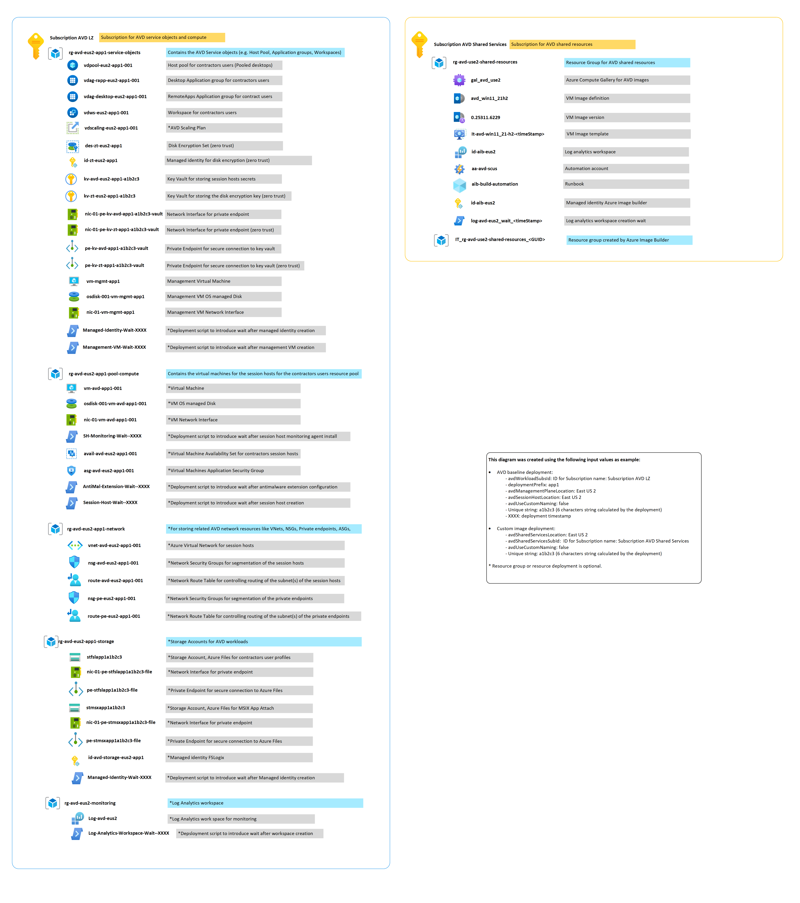
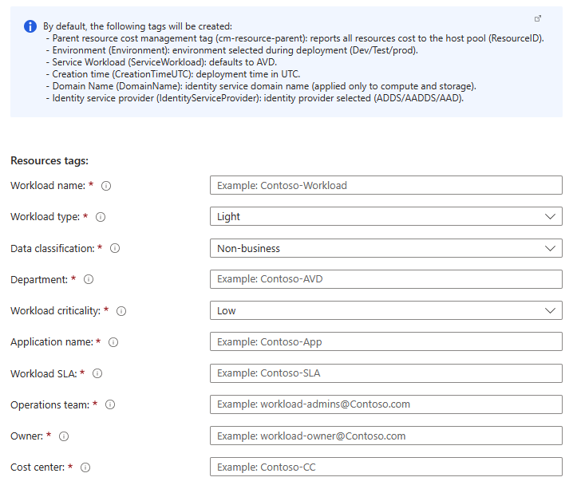
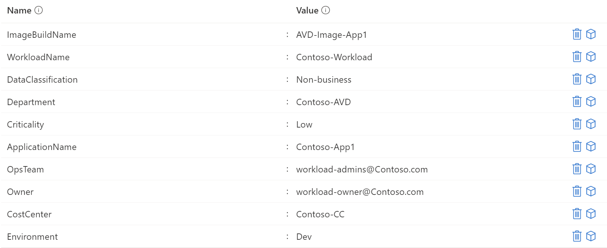

# Naming standard

:page_with_curl: **Note:** The baseline deployment will ask for a "deploymentPrefix" which will be included in all the deployed resources.
The naming of resources is hard coded in the templates but can also be modified as required prior to deployment.

## Resource naming for the baseline deployment

### Service Objects (Azure Virtual Desktop management plane)

| Resource Name | Resource Type | Description |
|:--|:--|:--|
| `rg-avd-{deploymentPrefix}-{DeploymentEnvironment}-{AzureRegionAcronym}-service-objects` | Resource Group | Contains related Azure Virtual Desktop service objects. |
| `vdws-{deploymentPrefix}-{DeploymentEnvironment}-{AzureRegionAcronym}-{nnn}` | Azure Virtual Desktop Workspace | |
| `vdpool-{deploymentPrefix}-{DeploymentEnvironment}-{AzureRegionAcronym}-{nnn}` | Azure Virtual Desktop Host pool | |
| `vdag-desktop-{deploymentPrefix}-{DeploymentEnvironment}-{AzureRegionAcronym}-{nnn}` | Azure Virtual Desktop Application group (Desktop) | |
| `vdag-rapp-{deploymentPrefix}-{DeploymentEnvironment}-{AzureRegionAcronym}-{nnn}` | Azure Virtual Desktop Application group (RemoteApp) | |
| `vdscaling-{deploymentPrefix}-{DeploymentEnvironment}-{AzureRegionAcronym}-{nnn}` | Azure Virtual Desktop Scaling Plan | |
| `des-zt-{deploymentPrefix}-{DeploymentEnvironment}-{AzureRegionAcronym}-{uniqueString}` | Disk Encryption Set (Zero Trust) | |
| `DiskEncryptionKey` | Key (Zero Trust) | |
| `kv-sec-{deploymentPrefix}-{DeploymentEnvironment}-{AzureRegionAcronym}-{uniqueString}` | Key vault | |
| `kv-key-{deploymentPrefix}-{DeploymentEnvironment}-{AzureRegionAcronym}-{uniqueString}` | Key vault (Zero Trust) | |
| `id-zt-{deploymentPrefix}-{DeploymentEnvironment}-{AzureRegionAcronym}-{nnn}` | Managed identity (Zero Trust) | Identity used for enabling server-side encryption with a customer managed key. |
| `pe-kv-sec-{deploymentPrefix}-{DeploymentEnvironment}-{AzureRegionAcronym}-{uniqueString}-vault` | Private endpoint | Private endpoint attached to key vault. |
| `pe-kv-key-{deploymentPrefix}-{DeploymentEnvironment}-{AzureRegionAcronym}-{uniqueString}-vault` | Private endpoint (Zero Trust) | Private endpoint attached to key vault. |
| `nic-{nn}-pe-kv-sec-{deploymentPrefix}-{DeploymentEnvironment}-{AzureRegionAcronym}-{uniqueString}-vault` | Network Interface | Network interface attached to key vault private endpoint. |
| `nic-{nn}-pe-kv-key-{deploymentPrefix}-{DeploymentEnvironment}-{AzureRegionAcronym}-{uniqueString}-vault` | Network Interface (Zero Trust) | Network interface attached to key vault private endpoint. |
| `vmmgmt{deploymentPrefix}{DeploymentEnvironment-d/t/p}{AzureRegionAcronym}` | Virtual Machine | VM used to run management tasks (FSLogix, NTFS permissions, etc.). |
| `osdisk-{nn}-vmmgmt{deploymentPrefix}{DeploymentEnvironment-d/t/p}{AzureRegionAcronym}` | Disk | OS disk attached to management VM. |
| `nic-{nn}-vm-vmmgmt{deploymentPrefix}{DeploymentEnvironment-d/t/p}{AzureRegionAcronym}` | Network Interface | Network interface attached to management VM. |

### Pool Compute naming (Session hosts)

| Resource Name | Resource Type | Description |
|:--|:--|:--|
| `rg-avd-{deploymentPrefix}-{DeploymentEnvironment}-{AzureRegionAcronym}-pool-compute` | Resource Group | |
| `asg-{deploymentPrefix}-{DeploymentEnvironment}-{AzureRegionAcronym}-{nnn}` | Application Security Group | |
| `avail-{deploymentPrefix}-{DeploymentEnvironment}-{AzureRegionAcronym}-{nnn}` | Availability set | Deployed when not using availability zones. |
| `vm{deploymentPrefix}{DeploymentEnvironment-d/t/p}{AzureRegionAcronym}{nnnn}` | Virtual Machine | |
| `osdisk-{nn}-vm{deploymentPrefix}{DeploymentEnvironment-d/t/p}{AzureRegionAcronym}{nnnn}` | Disk | OS disk attached to session hosts. |
| `nic-{nn}-vm{deploymentPrefix}{DeploymentEnvironment-d/t/p}{AzureRegionAcronym}{nnnn}` | Network Interface | NEtwork interface attached to session hosts. |

### Storage naming (FSLogix & MSIX App Attach)

| Resource Name | Resource Type | Description |
|:--|:--|:--|
| `rg-avd-{deploymentPrefix}-{DeploymentEnvironment}-{AzureRegionAcronym}-storage` | Resource Group | |
| `id-storage-{deploymentPrefix}-{DeploymentEnvironment}-{AzureRegionAcronym}-{nnn}` | Managed identity | Identity used for FSLogix setup. |
| `stfsl{deploymentPrefix}{DeploymentEnvironment-d/t/p}{uniqueString}` | Storage account | FSLogix file shares. |
| `pe-stfsl{deploymentPrefix}{DeploymentEnvironment-d/t/p}{uniqueString}-file` | Private endpoint | Private endpoint attached to FSLogix storage account files service. |
| `nic-{nn}-pe-stfsl{deploymentPrefix}{DeploymentEnvironment-d/t/p}{uniqueString}-file` | Network Interface | Network interface attached to FSLogix storage account's private endpoint. |
| `stmsx{deploymentPrefix}{DeploymentEnvironment-d/t/p}{uniqueString}` | Storage account | MSIX App Attach file shares. |
| `pe-stmsx{deploymentPrefix}{DeploymentEnvironment-d/t/p}{uniqueString}-file` | Private endpoint | Private endpoint attached to MSIX App Attach storage account files service. |
| `nic-{nn}-pe-stmsx{deploymentPrefix}{DeploymentEnvironment-d/t/p}{uniqueString}-file` | Network Interface | Network interface attached to MSIX App Attach storage account's private endpoint. |

### Network naming

| Resource Name | Resource Type | |
|:--|:--|:--|
| `rg-avd-{deploymentPrefix}-{DeploymentEnvironment}-{AzureRegionAcronym}-network` | Resource Group | |
| `nsg-avd-{deploymentPrefix}-{DeploymentEnvironment}-{AzureRegionAcronym}-{nnn}` | Network Security Group | |
| `route-avd-{deploymentPrefix}-{DeploymentEnvironment}-{AzureRegionAcronym}-{nnn}` | Route Table | |
| `vnet-{deploymentPrefix}-{DeploymentEnvironment}-{AzureRegionAcronym}-{nnn}` | Virtual Network | |
| `snet-avd-{deploymentPrefix}-{DeploymentEnvironment}-{AzureRegionAcronym}-{nnn}` | Virtual Network Subnet | |
| `snet-pe-{deploymentPrefix}-{DeploymentEnvironment}-{AzureRegionAcronym}-{nnn}` | Virtual Network Subnet | |
| `privatelink.file.core.windows.net` | Private DNS zone | |
| `privatelink.vaultcore.azure.net` | Private DNS zone | |

### Monitoring naming

| Resource Name | Resource Type | |
|:--|:--|:--|
| `rg-avd-{DeploymentEnvironment}-{AzureRegionAcronym}-monitoring` | Resource Group | |
| `log-avd-{DeploymentEnvironment}-{AzureRegionAcronym}` | Log Analytics Workspace | |

### Resource naming for the custom image build deployment

#### Azure Virtual Desktop - Custom image build - Naming

| Resource Name | Resource Type | |
|:--|:--|:--|
| `rg-avd-{AzureRegionAcronym}-shared-services` | Resource Group | |
| `aa-avd-{AzureRegionAcronym}` | Automation Account | |
| `aib-build-automation` | Automation Account Runbook| |
| `id-aib-{AzureRegionAcronym}` | Managed Identity | Used to grant access to Azure Image Builder. |
| `it-avd-{osVersion}` | Image Template | |
| `avd-{osVersion}` | VM Image Definition | |
| `gal_avd_{AzureRegionAcronym}` | Azure compute gallery | |

### Resource naming example

### Tagging for the baseline deployment

| Tag Name | Tag Value | Description |
|:--|:--|:--|
| Workload name |  |  |
| Workload type | Light,Medium,High,Power |  |
| Data classification | Non-business,Public,General,Confidential,Highly-confidential |  |
| Department |  |  |
| Workload Criticality | Low,Medium,High,Mission-Critical,Custom |  |
| Application name  |  |  |
| Workload SLA  |  |  |
| Operations team  |  |  |
| Owner  |  |  |
| Cost Center  |  |  |
| Environment type  | Dev,Staging,Prod  |  |
| Creation date |  |  |

Azure Virtual Desktop baseline tagging example:

### Tagging for the custom image build deployment

| Tag Name | Tag Value | Description |
|:--|:--|:--|
| Image build name |  |  |
| Workload name |  |  |
| Data classification | Non-business,Public,General,Confidential,Highly-confidential |  |
| Department |  |  |
| Workload Criticality | Low,Medium,High,Mission-Critical,Custom |  |
| Application name  |  |  |
| Workload SLA  |  |  |
| Operations team  |  |  |
| Owner  |  |  |
| Cost Center  |  |  |
| Environment type  | Dev,Staging,Prod |  |
| Creation date |  |  |

Custom image tagging example:

## Next Steps

Continue with:

1. [Azure Virtual Desktop LZA - Custom image build - Deployment (optional)](./deploy-custom-image.md) to build an updated and optimized image; or
2. [Azure Virtual Desktop LZA - Baseline - Deployment](./deploy-baseline.md) if you are ready to deploy an AVD workload from the market place, an updated and optimized image previously created by the custom image deployment, or the the Azure market place or from an Azure Compute Gallery
