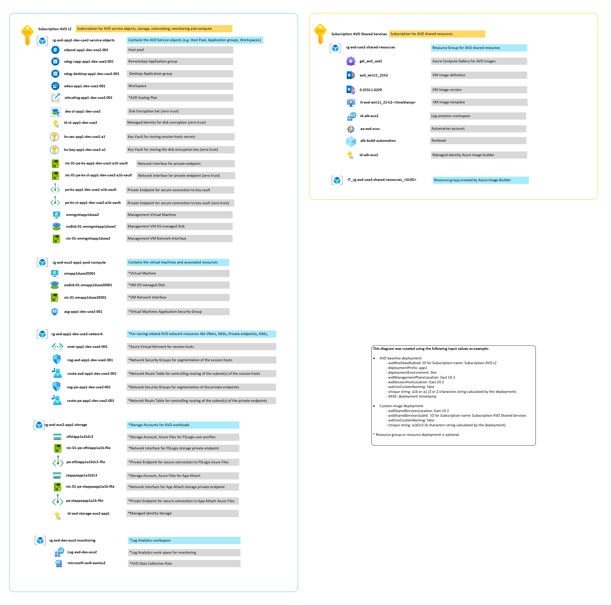

# Naming standard

:page_with_curl: **Note:** The baseline deployment will ask for a "deploymentPrefix" which will be included in all the deployed resources.
The naming of resources is hard coded in the templates but can also be modified as required prior to deployment.

## Resource naming for the baseline deployment

### Service Objects (AVD management plane)

| Resource Name | Resource Type | Description |
|:--|:--|:--|
| `rg-avd-{AzureRegionAcronym}-{deploymentPrefix}-service-objects` | Resource Group | Contains related AVD service objects. |
| `vdws-{AzureRegionAcronym}-{deploymentPrefix}-{nnn}` | AVD Workspace | |
| `vdpool-{AzureRegionAcronym}-{deploymentPrefix}-{nnn}` | AVD Host pool | |
| `vdag-desktop-{AzureRegionAcronym}-{deploymentPrefix}-{nnn}` | AVD Application group (Desktop) | |
| `vdag-rapp-{AzureRegionAcronym}-{deploymentPrefix}-{nnn}` | AVD Application group (RemoteApp) | |
| `vdscaling-{AzureRegionAcronym}-{deploymentPrefix}-{nnn}` | AVD Scaling Plan | |
| `kv-avd-{AzureRegionAcronym}-{deploymentPrefix}-{uniqueString}` | Key vault | |
| `pe-kv-avd-{AzureRegionAcronym}-{deploymentPrefix}-{uniqueString}-vault` | Private endpoint | Private endpoint attached to key vault. |
| `nic-{nn}-pe-kv-avd-{AzureRegionAcronym}-{deploymentPrefix}-{uniqueString}-vault` | Network Interface | Network interface attached to key vault private endpoint. |
| `AVD-managementVmWait-{Timestamp}` | Deployment script | Introduce wait time after management VM creation. |
| `vm-mgmt-{deploymentPrefix}` | Virtual Machine | VM used to run management tasks (FSLogix, NTFS permissions, etc.). |
| `osdisk-{nnn}-vm-mgmt-{deploymentPrefix}` | Disk | OS disk attached to management VM. |
| `nic-{nn}-vm-mgmt-{deploymentPrefix}` | Network Interface | Network interface attached to management VM. |

### Pool Compute naming (Session hosts)

| Resource Name | Resource Type | Description |
|:--|:--|:--|
| `rg-avd-{AzureRegion}-{deploymentPrefix}-pool-compute` | Resource Group | |
| `asg-avd-{AzureRegion}-{deploymentPrefix}-{nnn}` | Application Security Group | |
| `avail-avd-{AzureRegion}-{deploymentPrefix}-{nnn}` | Availability set | Deployed when not using availability zones. |
| `osdisk-{nnn}-vm-avd-{deploymentPrefix}-{nnn}` | Disk | OS disk attached to session hosts. |
| `nic-{nn}-vm-avd-{deploymentPrefix}-{nnn}` | Network Interface | NEtwork interface attached to session hosts. |
| `vm-avd-{deploymentPrefix}-{nnn}` | Virtual Machine | |
| `Antimalware-Extension-Wait-{Timestamp}` | Deployment script | Introduce wait time after antimalware extension configuration. |
| `Session-Hosts-Wait-{Timestamp}` | Deployment script | Introduce wait time after session host creation. |
| `SH-Monitoring-Wait-{Timestamp}` | Deployment script | Introduce wait time after session monitoring agent. |

### Storage naming (FSLogix & MSIX App Attach)

| Resource Name | Resource Type | Description |
|:--|:--|:--|
| `rg-avd-{AzureRegion}-{deploymentPrefix}-storage` | Resource Group | |
| `id-avd-storage-{AzureRegion}-{deploymentPrefix}` | Managed identity | Identity used for FSLogix setup. |
| `Managed-Identity-Wait-{Timestamp}` | Deployment script | Introduce wait time after managed identity creation. |
| `stfsl{deploymentPrefix}{uniqueString}` | Storage account | FSLogix file shares. |
| `pe-stfsl{deploymentPrefix}{uniqueString}-file` | Private endpoint | Private endpoint attached to FSLogix storage account files service. |
| `nic-{nn}-pe-stfsl{deploymentPrefix}{uniqueString}-file` | Network Interface | Network interface attached to FSLogix storage account's private endpoint. |
| `stmsx{deploymentPrefix}{uniqueString}` | Storage account | MSIX App Attach file shares. |
| `pe-stmsx{deploymentPrefix}{uniqueString}-file` | Private endpoint | Private endpoint attached to MSIX App Attach storage account files service. |
| `nic-{nn}-pe-stmsx{deploymentPrefix}{uniqueString}-file` | Network Interface | Network interface attached to MSIX App Attach storage account's private endpoint. |

### Network naming

| Resource Name | Resource Type | |
|:--|:--|:--|
| `rg-avd-{AzureRegionAcronym}-{deploymentPrefix}-network` | Resource Group | |
| `nsg-avd-{AzureRegionAcronym}-{deploymentPrefix}-{nnn}` | Network Security Group | |
| `route-avd-{AzureRegionAcronym}-{deploymentPrefix}-{nnn}` | Route Table | |
| `vnet-avd-{AzureRegionAcronym}-{deploymentPrefix}-{nnn}` | Virtual Network | |
| `snet-avd-{AzureRegionAcronym}-{deploymentPrefix}-{nnn}` | Virtual Network Subnet | |
| `peer-avd-{AzureRegionAcronym}-{deploymentPrefix}-{nnn}-{uniqueString}` | Virtual Network Peering | |

### Monitoring naming

| Resource Name | Resource Type | |
|:--|:--|:--|
| `rg-avd-{AzureRegionAcronym}-monitoring` | Resource Group | |
| `Log-Analytics-Workspace-Wait-{Timestamp}` | Deployment Script | Introduce wait time after log analytics workspace creation. |
| `log-avd-{AzureRegionAcronym}` | Log Analytics Workspace | |

### Resource naming for the custom image deployment

#### AVD Custom Image naming

| Resource Name | Resource Type | |
|:--|:--|:--|
| `rg-avd-{AzureRegionAcronym}-shared-services` | Resource Group | |
| `aa-avd-{AzureRegionAcronym}` | Automation Account | |
| `aib-build-automation` | Automation Account Runbook| |
| `id-aib-{AzureRegionAcronym}` | Managed Identity | Used to grant access to Azure Image Builder. |
| `it-avd-{osVersion}` | Image Template | |
| `avd-{osVersion}` | VM Image Definition | |
| `gal_avd_{AzureRegionAcronym}` | Azure compute gallery | |

### Resource naming example

### Tagging for the baseline deployment

| Tag Name | Tag Value | Description |
|:--|:--|:--|
| Workload name |  |  |
| Workload type | Light,Medium,High,Power |  |
| Data classification | Non-business,Public,General,Confidential,Highly-confidential |  |
| Department |  |  |
| Workload Criticality | Low,Medium,High,Mission-Critical,Custom |  |
| Application name  |  |  |
| Workload SLA  |  |  |
| Operations team  |  |  |
| Owner  |  |  |
| Cost Center  |  |  |
| Environment type  | Dev,Staging,Prod  |  |
| Creation date |  |  |

AVD baseline tagging example:

### Tagging for the custom image build deployment

| Tag Name | Tag Value | Description |
|:--|:--|:--|
| Image build name |  |  |
| Workload name |  |  |
| Data classification | Non-business,Public,General,Confidential,Highly-confidential |  |
| Department |  |  |
| Workload Criticality | Low,Medium,High,Mission-Critical,Custom |  |
| Application name  |  |  |
| Workload SLA  |  |  |
| Operations team  |  |  |
| Owner  |  |  |
| Cost Center  |  |  |
| Environment type  | Dev,Staging,Prod |  |
| Creation date |  |  |

Custom image tagging example:

## Next Steps

Continue with:

1. [Custom image deployment (optional)](./deploy-custom-image.md) to build an updated and optimized image; or
2. [AVD accelerator baseline deployment](./deploy-baseline.md) if you are ready to deploy an AVD workload from the market place, an updated and optimized image previously created by the custom image deployment, or the the Azure market place or from an Azure Compute Gallery
