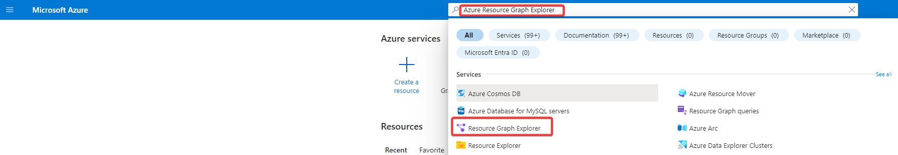
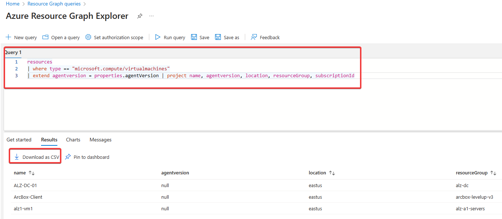

# Steps to migrate Log Analytics agent (also known as MMA and OMS) to Azure Monitor Agent (AMA)

# As a reference please review  [Monitoring Agent Migration WorkFlow](https://learn.microsoft.com/en-us/azure/azure-monitor/agents/azure-monitor-agent-migration-tools?tabs=portal-1)

## The main purposes of the scripts are:
* Create a report with Azure VMs still running legacy monitoring agent (MMA)
* Based on the report remove legacy monitoring agent

## How to use it?
- Create report via PS: 
  - 01_MMA_Report.ps1 - is to gather current AVD hosts wich have been monitored via MMA agent and export it to csv file
- Create report via Azure Resource Graph Explorer
  - Login to [Azure Portal](https://portal.azure.com/) 
  - In the main search type _'Azure Resource Graph Explorer'_



- Run the query 



```console
resources
| where type == "microsoft.compute/virtualmachines"
| extend agentversion = properties.agentVersion | project name, agentversion, location, resourceGroup, subscriptionId
```

- Review the report to confirm the list of VMs with MMA agent

- 02_MMA_Extention_remove.ps1 that script will reference the csv report and remove MMA agent