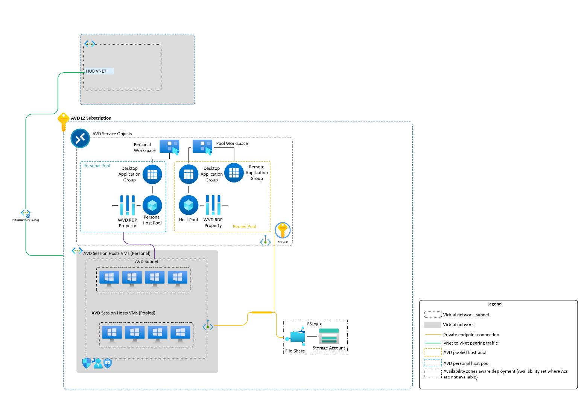
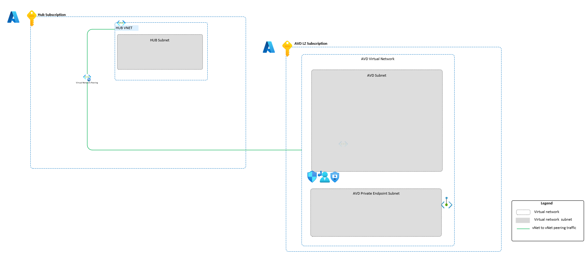
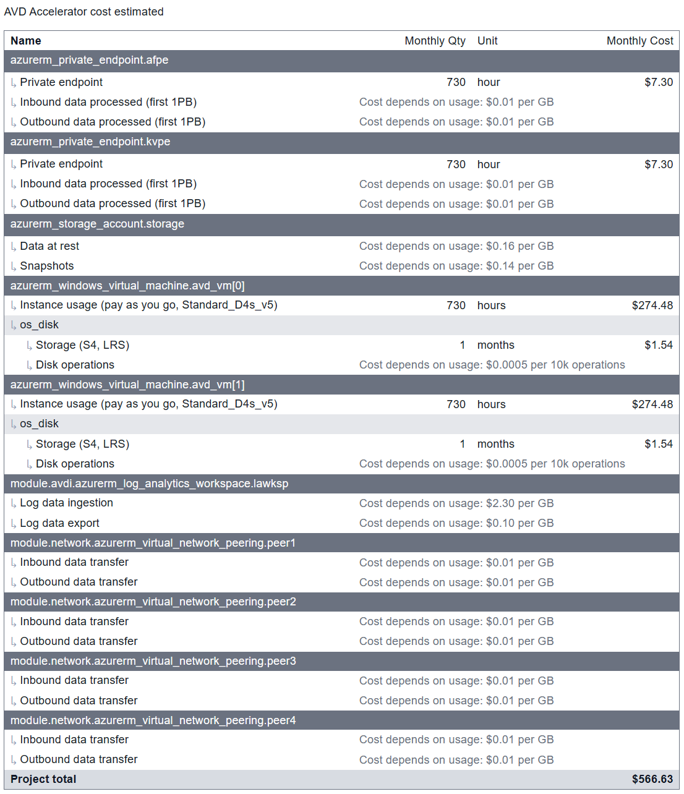

# Implement Azure Virtual Desktop with Microsoft Entra ID

This guide is designed to help you get started with deploying a greenfield Azure Virtual Desktop using the provided Terraform template(s) within this repository. Before you deploy, it is recommended to review the template(s) to understand the resources that will be deployed and the associated costs.

This accelerator is to be used as starter kit and you can expand its functionality by developing your own deployments. This scenario deploys a new Azure Virtual Desktop workload with Azure AD joined session host using a custom image, so it cannot be used to maintain, modify or add resources to an existing or already deployed Azure Virtual Desktop workload from this accelerator.

***Note*** This terraform accelerator requires the Custom Image Build before deploying the Baseline. If you prefer to use the marketplace image with no customization [see](https://docs.microsoft.com/en-us/azure/developer/terraform/create-avd-session-host)

## Table of contents

- [Implement Azure Virtual Desktop with Microsoft Entra ID](#implement-azure-virtual-desktop-with-azure-active-directory)
  - [Table of contents](#table-of-contents)
  - [Scenario Overview](#scenario-overview)
    - [Azure Architecture](#azure-architecture)
    - [AVD-Network](#avd-network)
  - [Prerequisites](#prerequisites)
    - [Naming](#naming)
    - [Decide on a Prefix](#decide-on-a-prefix)
    - [Assumptions](#assumptions)
  - [Implementation](#implementation)
  - [Deployment Steps](#deployment-steps)
  - [Estimated Cost](#estimated-cost)
  - [Reporting issues](#reporting-issues)

## Scenario Overview

### Azure Architecture

This scenario is a greenfield Azure Virtual Desktop deployment using Azure AD joined session host and a pre-existing custom image.
The solution implements a new:

- Azure Virtual Desktop resources:
  - 1 Host Pools – pooled
  - 1 Desktop application group
  - 1 Workspaces – 1 pooled
  - AVD Monitoring, log analytics workspace and diagnostic logs enabled
  - AVD Scaling plan
- Azure Files Storage with FSLogix share, RBAC role assignment and private endpoint joined to Microsoft Entra ID
- Key Vault and private endpoint
- Azure Virtual Desktop spoke resources:
  - Virtual Network
  - Subnet
  - NSG
  - DNS Zone
  - Route table
- 1 Session host VMs Azure AD join using custom image
  - Application Security Group  

AVD Landing Zone concepts can be explored in more detail via the [official documentation page](https://learn.microsoft.com/en-us/azure/cloud-adoption-framework/scenarios/wvd/).



The Azure Virtual Desktop Baseline Terraform files are all written as individual files each having a specific function. Variables have been created in all files for consistency, all changes to defaults are to be changed from the terraform.tfvars.sample file.
In addition, modules for network and log analytics resources are in there folders respectively.

### AVD-Network

Azure Virtual Desktop resources and dependent services for establishing the Azure Virtual Desktop spoke network:

- Network Security group
- New VNet and subnet
- Baseline NSG
- Route table



## Prerequisites

- Meet the prerequisites listed [here](https://github.com/Azure/avdaccelerator/blob/main/workload/docs/getting-started.md)
- Current version of the [Azure CLI](https://docs.microsoft.com/en-us/cli/azure/install-azure-cli)
- Current version of the Terraform CLI
- An Azure Subscription(s) where you or an identity you manage has `Owner` [RBAC permissions](https://docs.microsoft.com/en-us/azure/role-based-access-control/built-in-roles#owner)
- Ensure Encryption at Host feature is already enabled on the subscription. To enable: az feature register --name EncryptionAtHost  --namespace Microsoft.Compute. To validate: az feature show --name EncryptionAtHost --namespace Microsoft.Compute

### Naming

Resource naming is configured by using local variables and each name is configured to use a prefix value.

### Decide on a Prefix

A "Prefix" which will be included in all the deployed resources name. Resource Groups and resource names are derived from the `Prefix` parameter. Pick a unique resource prefix that is 1-4 alphanumeric characters in length without white spaces.

### Assumptions

Azure platform landing zone has already been deployed in accordance with the [CAF](https://learn.microsoft.com/en-us/azure/cloud-adoption-framework/ready/landing-zone/)

[(Back to top)](#table-of-contents)

## Implementation

1. Clone your repo with the following git command:

```bash
  git clone <https://github.com/Azure/avdaccelerator.git>
```  

2. Change your terminal into that new subdirectory:

```bash
  cd workload/terraform/greenfield/AADscenario
  az account list --output table
  az account set --subscription 'Your subscription ID'
```

3. Rename terraform.tfvars.example and to remove the .copy TFVAR File
4. Set configuration variables:

- avdLocation          = "Your region"
- prefix               = "your prefix"
- local_admin_username = "your local admin name"  # Your AVD VM login id to manage username
- local_admin_password = "your local admin password"  # Your AVD VM login id to manage password
- vm_size              = "Standard_D2s_v5"
- vnet_range           = ["your.ip.address.range/16"]
- subnet_range         = ["your.ip.address.range/24"]
- allow_list_ip        = ["your.ip.address.range/23"]
- aad_group_name       = "Desktop Virtualization User"  #user group must pre-created in Azure AD
- rdsh_count           = 2
- image_name           = "yourimagename-microsoftwindowsdesktop-office-365-win11-21h2-avd-m365"
- image_rg             = "yourimageresourcegroup-WestEurope-avd-AIBdemo-shared-resources"
- gallery_name         = "yourimagegalleryname_WestEurope"
- spoke_subscription_id = "Your spoke subscription ID"
- hub_subscription_id = "Your hub subscription ID

## Deployment Steps

1. Modify the `terraform.tfvars` file to define the desired names, location, networking, and other variables
2. Before deploying, confirm the correct subscription
3. Change directory to the Terraform folder
4. Run `terraform init` to initialize this directory
5. Run `terraform plan` to view the planned deployment
6. Run `terraform apply` to confirm the deployment

[(Back to top)](#table-of-contents)

## Estimated Cost

A breakdown of estimated cost for this deployment. Adjust to sku will change the estimates.


58 were free:
- 20 x azurerm_log_analytics_datasource_windows_performance_counter
- 9 x azurerm_log_analytics_datasource_windows_event
- 5 x azurerm_resource_group
- 4 x azurerm_role_assignment
- 2 x azurerm_network_interface
- 2 x azurerm_private_dns_zone_virtual_network_link
- 2 x azurerm_subnet
- 1 x azurerm_application_security_group
- 1 x azurerm_firewall_policy_rule_collection_group
- 1 x azurerm_key_vault
- 1 x azurerm_key_vault_access_policy
- 1 x azurerm_key_vault_secret
- 1 x azurerm_network_security_group
- 1 x azurerm_storage_account_network_rules
- 1 x azurerm_subnet_network_security_group_association
- 1 x azurerm_user_assigned_identity
- 1 x azurerm_virtual_desktop_application_group
- 1 x azurerm_virtual_desktop_host_pool
- 1 x azurerm_virtual_desktop_workspace
- 1 x azurerm_virtual_desktop_workspace_application_group_association
- 1 x azurerm_virtual_network
 
Generated by: [Infracost](https://www.infracost.io/)
## Reporting issues

Microsoft Support is not yet handling issues for any published tools in this repository. However, we would like to welcome you to open issues using GitHub [issues](https://github.com/Azure/avdaccelerator/issues) to collaborate and improve these tools.
