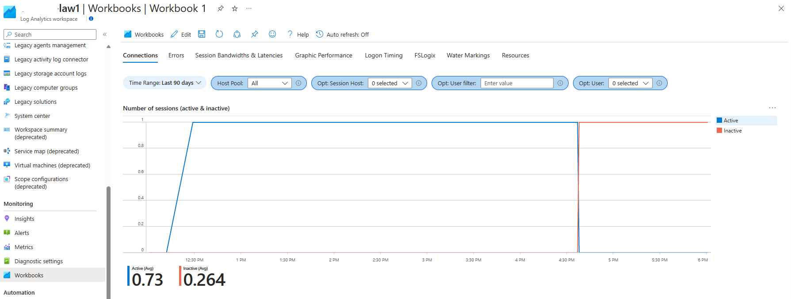
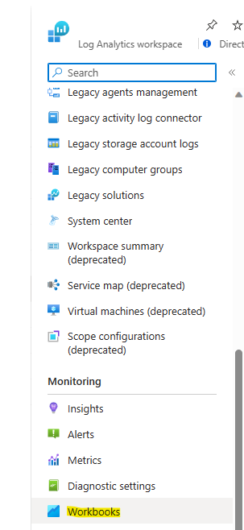
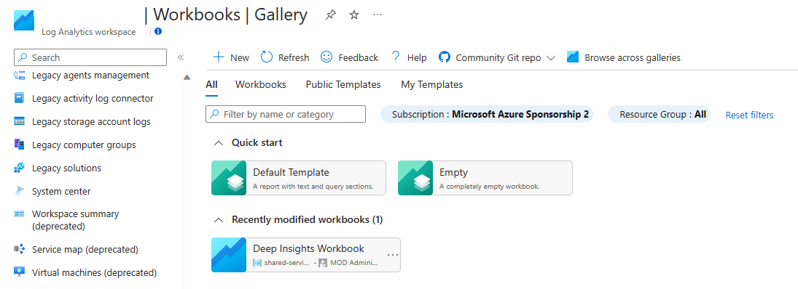
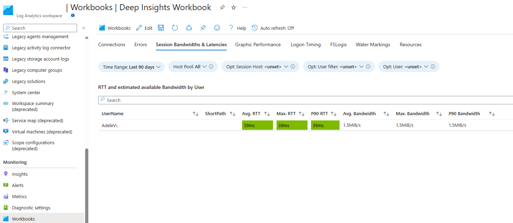

# Azure Virtual Desktop Deep Insights

The _'Azure Virtual Desktop Deep Insights Workbook'_ enables you to view and make meaningful inferences from diagnostic data sent to a log analytics workspace.

The main purposes of this Workbook are:
* View overall action sessions on AVD
* View and manage errors and unhealthy AVD hosts
* View bandwidth and latency data as well as logon timing, FSLogix data, etc.

[Deep Insights workbook](https://raw.githubusercontent.com/Azure/avdaccelerator/main/workload/workbooks/deepInsightsWorkbook/deepInsights.workbook)

## Type of resources covered:

* Connects: both active and inactive along with number of session hosts
* Errors: unhealthy session hosts broken down by client, IP segment, session host agent, etc.
* Bandwidth data per user such as average RTT, average bandwidtch, etc.
* Graphic performance data averaged over the selected host pool
* Logon timing data per user
* FSLogix profile disks by user name and host pool
* Watermarking capabilities to query a specific session by GUID
* Orphan resources such as session hosts, virtual machines, NICs, etc. that might need cleaned up

## How to use it?

NOTE: You must already setup diagnostic logs for your AVD environment for this workbook to show meaningful data. If the queries return nothing, be sure diagnostic logs are setup properly and you are working in the correct Log Analytics Workspace.

Importing this Workbook to your Azure environment.

Follow this steps:

* Login to [Azure Portal](https://portal.azure.com/) 
* Go to _'Log Analytics Workspaces'_ and select the one you send your AVD diagnostic logs 

* Click on _'+ Create'_

* Click on _'+ New'_

* Open the Advanced Editor using the _'</>'_ button on the toolbar

* Select the _'Gallery Template'_ (step 1)
* Replace the JSON in the gallery template to the [Deep Insights workbook](https://raw.githubusercontent.com/Azure/avdaccelerator/main/workload/workbooks/deepInsightsWorkbook/deepInsights.workbook) (step 2)
* Click _'Apply'_ (step 3)

* Click in the ‘Save’ button on the toolbar

* Select a name and where to save the Workbook:

* Title: _'Deep Insights Workbook'_
* Subscription: _Subscription Name_
* Resource group: _Resource Group Name_
* Location: _Region_
* Click _'Save'_
  
The Workbook is ready to use!

* From Azure portal search for _'Log Analytics Workspace'_ and click on your chosen Log Analytics Workspace
* Click on workbooks
* Click on _'Deep Insights Workbook'_ Workbook.

Start using the Workbook and review your Deep Insights workbook.
Filter by specific subscription is optional.

