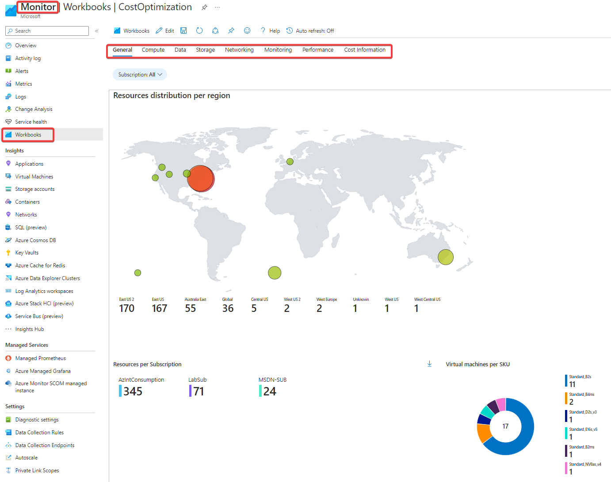
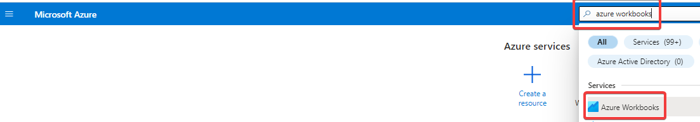
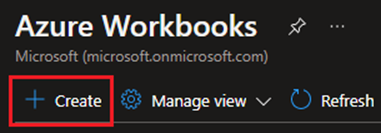
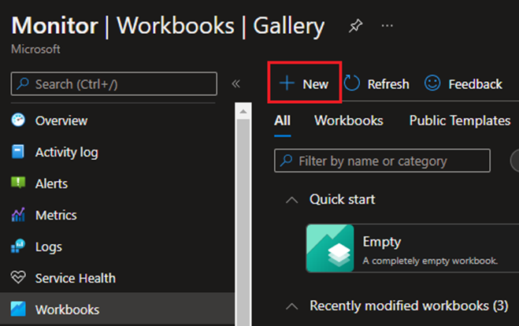
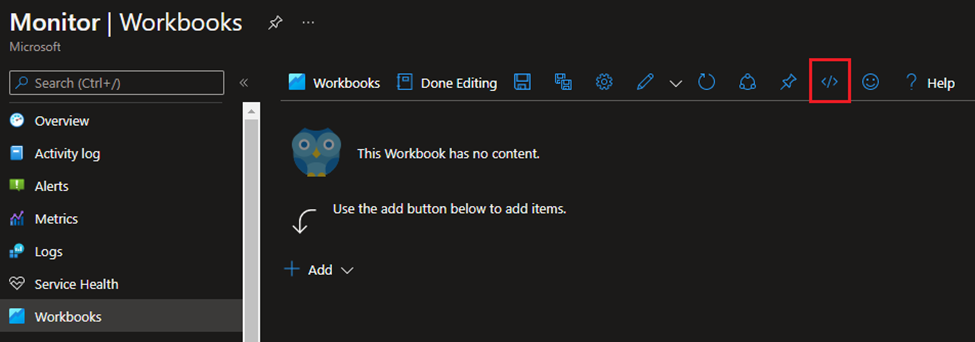
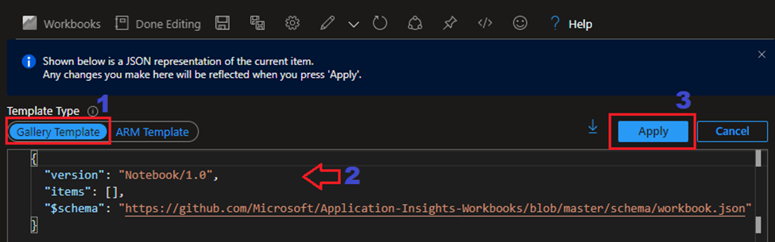
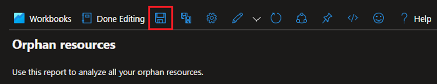
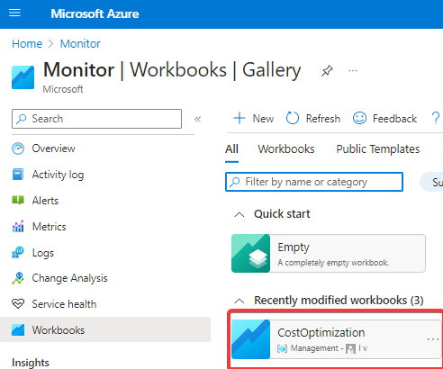

# Azure Cost Optimization

The _'Azure Cost Optimization workbook Workbook'_ centralize Cost Optimization workbook in Azure environments.

The main purposes of this Workbook are:
* Save money
* Prevent mistakes and misconfiguration
* Simplify operational

[Cost Optimization workbook](./CostOptimization.workbook)

Type of resources covered:
* Resources distribution per region
* Tagged vs Untagged Resource Groups
* Windows VMs and VM scale sets without Azure Hybrid Benefit enabled
* Azure SQL Databases not using Hybrid Benefit
* Azure SQL Managed Instances not using Hybrid Benefit
* Virtual Machines in a Stopped State
* Virtual Machine Performance
* Disks
* Network Interfaces
* Public IPs
* Resource Groups
* Network Security Groups (NSGs)
* Availability Set

## How to use it?
Importing this Workbook to your Azure environment.

Follow this steps:
* Login to [Azure Portal](https://portal.azure.com/) 
* Go to _'Azure Workbooks'_

* Click on _'+ Create'_

* Click on _'+ New'_

 

* Open the Advanced Editor using the _'</>'_ button on the toolbar

 

* Select the _'Gallery Template'_ (step 1)
* Replace the JSON in the gallery template to the [Cost Optimization workbook](./CostOptimization.workbook) (step 2)
* Click _'Apply'_ (step 3)

 

* Click in the ‘Save’ button on the toolbar

  

* Select a name and where to save the Workbook:
- Title: _'Cost Optimization workbook'_
- Subscription: _Subscription Name_
- Resource group: _Resource Group Name_
- Location: _Region_
* Click _'Save'_
  
The Workbook is ready to use!
* From Azure portal search for _'Monitor'_
* Click on _'Cost Optimization workbook'_ Workbook.

  

Start using the Workbook and review your Cost Optimization workbook. 
Filter by specifig subscription is optional.

 